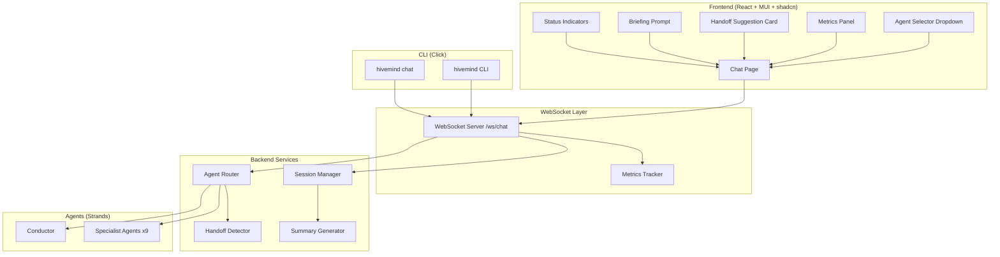

# Design Document: Agent Handoff UI

## Overview

This design covers the modernization of the HiveMind user interface across three surfaces — web GUI, CLI, and live metrics — plus the addition of intelligent agent handoff capabilities. The system enables users to start conversations with the Conductor agent by default, switch agents mid-conversation via a UI dropdown, receive intelligent handoff suggestions based on intent detection, preserve and share conversation context across agents, and monitor live session metrics.

The web frontend migrates from vanilla HTML/CSS/JS to a React-based application using MUI (Material UI) and shadcn/ui component libraries. The CLI migrates from argparse to Click. A new metrics tracking layer is added to the WebSocket server to surface token usage, context window consumption, and network statistics.

## Architecture



### Key Architectural Decisions

1. **React migration**: The vanilla HTML/JS frontend is replaced with a React SPA using Vite as the build tool. This enables use of MUI and shadcn component libraries which require a React runtime. The FastAPI server continues to serve the built static assets.

2. **Handoff detection in Agent_Router**: Intent detection for handoff is implemented as a keyword/pattern matching layer in `agent_router.py` rather than delegating to the Conductor LLM for every message. This keeps handoff fast and deterministic. The Conductor LLM is only invoked for ambiguous capability-matching requests.

3. **Cross-agent briefing via summary injection**: When a user opts to brief an agent, the Session_Manager generates a text summary of recent cross-agent conversations and prepends it to the user's next message as system context. This avoids modifying the agent's conversation history directly.

4. **Metrics tracking at WebSocket layer**: Token counts and timing metrics are tracked in a `MetricsTracker` class within the WebSocket server, updated on each agent response. This keeps metrics collection centralized and avoids coupling it to individual agents.

5. **CLI with Click**: The CLI is rebuilt using Click's decorator-based command groups, preserving all existing commands and flags. A new `hivemind chat` command provides an interactive REPL-style chat with agent switching.

## Components and Interfaces

### Frontend Components (React + MUI + shadcn)

#### ChatPage
- Root component for the chat interface
- Manages `activeAgent` state, message cache (keyed by agent ID), and WebSocket connection
- Renders: AgentSelector, ChatArea, Sidebar, MetricsPanel

#### AgentSelector
- MUI `Select` component with custom rendering
- Each option shows: agent icon, name, role, and status indicator (green/amber/red dot)
- Collapsed state shows current agent icon + name
- Emits `onAgentChange(agentId)` callback

#### HandoffSuggestionCard
- shadcn `Card` component displayed inline in the chat message list
- Shows: target agent icon, name, reason text
- Two action buttons: "Accept" (primary) and "Stay" (secondary)
- Emits `onAccept(targetAgentId)` or `onDecline()`

#### BriefingPrompt
- shadcn `AlertDialog` shown when switching back to a previously visited agent
- Two options: "Brief this agent" and "Continue where I left off"
- Emits `onBrief()` or `onContinue()`

#### MetricsPanel
- MUI `Paper` component in the sidebar
- Displays: tokens generated (counter), context window (MUI `LinearProgress` bar), messages exchanged, WebSocket latency
- Warning indicator when context usage exceeds 80%

#### StatusIndicator
- Small colored dot component (green/amber/red)
- Used in AgentSelector dropdown items and sidebar agent info

### Backend Components

#### HandoffDetector (new class in `agent_router.py`)

```python
class HandoffDetector:
    """Detects handoff intent from user messages."""
    
    # Keyword map: keyword/phrase -> agent_id
    EXPLICIT_KEYWORDS: Dict[str, str]
    # Capability map: capability description -> agent_id  
    CAPABILITY_MAP: Dict[str, str]
    
    def detect_handoff(self, message: str, current_agent_id: str) -> Optional[HandoffResult]:
        """Analyze message for handoff intent.
        
        Returns HandoffResult with target_agent_id and reason, or None.
        """
        ...
```

#### MetricsTracker (new class in `hivemind_web/metrics_tracker.py`)

```python
@dataclass
class SessionMetrics:
    total_tokens_generated: int = 0
    context_window_used: int = 0
    context_window_capacity: int = 128000
    total_messages_sent: int = 0
    total_messages_received: int = 0
    session_start_time: datetime
    last_response_latency_ms: float = 0.0

class MetricsTracker:
    """Tracks per-session metrics for the web GUI."""
    
    def __init__(self, context_window_capacity: int = 128000): ...
    def record_message_sent(self, session_id: str): ...
    def record_response(self, session_id: str, tokens: int, latency_ms: float): ...
    def get_metrics(self, session_id: str) -> SessionMetrics: ...
```

#### SummaryGenerator (new method in `session_manager.py`)

```python
def generate_cross_agent_summary(
    self,
    session_id: str,
    target_agent_id: str
) -> Optional[str]:
    """Generate a summary of conversations with other agents
    since the user last interacted with target_agent_id.
    
    Returns a text summary or None if no new cross-agent activity.
    """
    ...
```

#### Extended WebSocket Protocol Messages

| Direction | Type | Fields | Description |
|-----------|------|--------|-------------|
| Client→Server | `switch_agent` | `agent_id` | User manually switches agent |
| Server→Client | `agent_switched` | `agent_id`, `agent_name`, `agent_icon`, `agent_role`, `capabilities`, `agent_status` | Confirms agent switch with full metadata |
| Server→Client | `handoff_suggestion` | `target_agent_id`, `target_agent_name`, `target_agent_icon`, `reason` | Suggests switching to a specialist |
| Server→Client | `response` | `agent_id`, `message`, `status`, `metrics`, `agent_status` | Agent response with metrics and status |
| Client→Server | `message` | `agent_id`, `message`, `include_briefing` | Chat message, optionally with cross-agent briefing |
| Server→Client | `error` | `message` | Error response |

### CLI Components (Click)

#### Command Structure

```
hivemind
├── deploy          # Deploy application
├── status          # Check deployment status
├── analyze         # Analyze repository
├── plan            # Show deployment plan
├── rollback        # Rollback deployment
├── destroy         # Destroy deployment
├── update          # Blue-green update
├── upgrade         # Stage 1 → production
├── list            # List deployments
├── reconcile       # Reconcile state
├── find-orphans    # Find orphaned resources
├── cleanup         # Clean up temp files
├── fix-and-retry   # Apply fix and retry
├── preserve        # Preserve failed deployment
├── dashboard       # CloudWatch dashboard
└── chat            # Interactive agent chat (NEW)
```

#### `hivemind chat` Command

```python
@cli.command()
@click.option('--agent', '-a', default='conductor', help='Initial agent to chat with')
def chat(agent: str):
    """Interactive chat session with HiveMind agents."""
    # REPL loop with:
    # - Agent switching via /switch <agent_id>
    # - Metrics display after each response
    # - Colored output for agent responses
    # - Status indicators in prompt
    ...
```

## Data Models

### Frontend State

```typescript
interface AgentInfo {
  id: string;
  name: string;
  role: string;
  icon: string;
  capabilities: string[];
  status: 'available' | 'busy' | 'unavailable';
}

interface ChatMessage {
  id: string;
  role: 'user' | 'agent' | 'system';
  content: string;
  agentId: string;
  timestamp: string;
  type: 'text' | 'handoff_suggestion';
  handoffData?: HandoffSuggestion;
}

interface HandoffSuggestion {
  targetAgentId: string;
  targetAgentName: string;
  targetAgentIcon: string;
  reason: string;
}

interface SessionMetrics {
  totalTokensGenerated: number;
  contextWindowUsed: number;
  contextWindowCapacity: number;
  totalMessagesSent: number;
  totalMessagesReceived: number;
  lastResponseLatencyMs: number;
}

interface ChatState {
  activeAgentId: string;
  agents: AgentInfo[];
  messageCache: Record<string, ChatMessage[]>;  // keyed by agentId
  metrics: SessionMetrics;
  sessionId: string | null;
  connected: boolean;
}
```

### Backend Models

```python
@dataclass
class HandoffResult:
    target_agent_id: str
    target_agent_name: str
    target_agent_icon: str
    reason: str

@dataclass 
class AgentStatus:
    agent_id: str
    status: str  # "available", "busy", "unavailable"
    processing_since: Optional[datetime] = None
```

### Session Manager Extensions

The existing `AgentSession` dataclass gains a `last_interaction_at` field:

```python
@dataclass
class AgentSession:
    agent_id: str
    conversation_history: List[ConversationMessage] = field(default_factory=list)
    last_activity: datetime = field(default_factory=datetime.now)
    last_interaction_at: datetime = field(default_factory=datetime.now)  # NEW
```

The `UserSession` gains a method to get cross-agent messages since a timestamp, and the `SessionManager` gains the `generate_cross_agent_summary` method.


## Correctness Properties

*A property is a characteristic or behavior that should hold true across all valid executions of a system — essentially, a formal statement about what the system should do. Properties serve as the bridge between human-readable specifications and machine-verifiable correctness guarantees.*

### Property 1: Invalid or missing agent parameter defaults to Conductor

*For any* agent query parameter value that is not a recognized agent ID (including absent/empty), the resolved active agent SHALL be the Conductor (`conductor`).

**Validates: Requirements 1.1, 1.3**

### Property 2: Valid agent parameter resolves correctly

*For any* valid agent ID from the known agent set, navigating with that agent ID as the query parameter SHALL set the active agent to that exact agent ID.

**Validates: Requirements 1.2**

### Property 3: Agent Selector displays all agents with required fields

*For any* set of agents returned by the API, the Agent Selector dropdown SHALL render an entry for each agent containing its icon, name, and role.

**Validates: Requirements 2.1, 2.2**

### Property 4: Agent selection updates active agent state

*For any* agent selected from the Agent Selector, the active agent state SHALL equal the selected agent's ID.

**Validates: Requirements 2.3**

### Property 5: Agent switch sends WebSocket message

*For any* agent switch action, a WebSocket message of type `switch_agent` SHALL be sent containing the new agent ID.

**Validates: Requirements 2.5**

### Property 6: Message cache round-trip preservation

*For any* sequence of messages with an agent, switching to a different agent and then switching back SHALL restore the exact same messages in the same order.

**Validates: Requirements 3.1, 3.2**

### Property 7: Session Manager maintains per-agent isolation

*For any* session with messages sent to multiple agents, querying the conversation history for a specific agent SHALL return only messages associated with that agent.

**Validates: Requirements 3.4**

### Property 8: Cross-agent briefing summary accuracy

*For any* session where the user has interacted with agents A and B, when the user switches back to agent A and requests a briefing, the generated summary SHALL contain only messages from other agents that occurred after the user's last interaction with agent A.

**Validates: Requirements 3.6, 3.8**

### Property 9: Continue without briefing injects no context

*For any* agent switch where the user chooses to continue without briefing, the next message sent to the agent SHALL not contain any cross-agent summary prefix.

**Validates: Requirements 3.7**

### Property 10: Explicit keyword handoff detection

*For any* message sent to the Conductor containing a known agent keyword or name reference, the HandoffDetector SHALL return a HandoffResult with the correct target agent ID.

**Validates: Requirements 4.1**

### Property 11: Capability-based handoff detection

*For any* message sent to the Conductor describing a task that matches a specialist agent's registered capabilities, the HandoffDetector SHALL return a HandoffResult with the matching agent ID.

**Validates: Requirements 4.2**

### Property 12: Handoff detection produces valid suggestion message

*For any* detected handoff intent, the WebSocket response SHALL be of type `handoff_suggestion` and contain non-empty `target_agent_id`, `target_agent_name`, `target_agent_icon`, and `reason` fields.

**Validates: Requirements 4.3, 6.4**

### Property 13: Failed handoff falls back to Conductor response

*For any* message that does not match any agent keyword or capability, the response SHALL be a normal `response` type message from the Conductor (not a `handoff_suggestion`).

**Validates: Requirements 4.4**

### Property 14: Handoff accept switches agent

*For any* handoff suggestion, clicking "Accept" SHALL change the active agent to the suggested target agent ID and add a system message indicating the switch.

**Validates: Requirements 5.3, 5.5**

### Property 15: Handoff decline preserves current agent

*For any* handoff suggestion, clicking "Stay" SHALL leave the active agent unchanged.

**Validates: Requirements 5.4**

### Property 16: Valid switch_agent returns agent metadata

*For any* valid agent ID sent in a `switch_agent` WebSocket message, the server SHALL respond with an `agent_switched` message containing the agent's name, icon, role, capabilities, and status.

**Validates: Requirements 6.1**

### Property 17: Invalid switch_agent returns error

*For any* invalid agent ID sent in a `switch_agent` WebSocket message, the server SHALL respond with an `error` message.

**Validates: Requirements 6.2**

### Property 18: Response messages contain agent_id and agent_status

*For any* `response` or `agent_switched` message from the WebSocket server, the message SHALL contain both an `agent_id` field and an `agent_status` field.

**Validates: Requirements 6.3, 8.5**

### Property 19: Status indicator reflects agent status

*For any* agent with a known status value (`available`, `busy`, `unavailable`), the status indicator color SHALL be green for available, amber for busy, and red for unavailable, in both the Agent Selector dropdown and the sidebar.

**Validates: Requirements 8.1, 8.7**

### Property 20: Agent status transitions during message processing

*For any* message sent to an agent, the agent's status SHALL transition to `busy` when the message is sent and back to `available` when the response is received.

**Validates: Requirements 8.2, 8.3**

### Property 21: Unreachable agent reports unavailable status

*For any* agent that fails to load or respond, the WebSocket server SHALL report that agent's status as `unavailable`.

**Validates: Requirements 8.6**

### Property 22: CLI command parity

*For any* existing CLI command and its arguments, the Click-based CLI SHALL accept the same arguments and produce equivalent behavior to the argparse-based CLI.

**Validates: Requirements 10.1, 10.2**

### Property 23: CLI help generation

*For any* Click CLI command, invoking it with `--help` SHALL produce non-empty help text.

**Validates: Requirements 10.3**

### Property 24: Metrics accuracy in responses

*For any* sequence of N messages in a session, the `metrics` field in the Nth response SHALL report `total_messages_sent` equal to N and `total_messages_received` equal to N, and `total_tokens_generated` SHALL be the sum of all tokens from prior responses.

**Validates: Requirements 11.1, 11.2**

### Property 25: Metrics panel displays all required fields

*For any* metrics state update, the Metrics Panel SHALL display tokens generated, context window usage, messages exchanged, and latency values matching the metrics data.

**Validates: Requirements 11.3, 11.4**

### Property 26: Context window warning threshold

*For any* metrics state where `context_window_used / context_window_capacity > 0.80`, the Metrics Panel SHALL display a warning indicator. *For any* metrics state where the ratio is ≤ 0.80, no warning SHALL be displayed.

**Validates: Requirements 11.6**

## Error Handling

### WebSocket Errors

- **Invalid agent ID on switch**: Return `{"type": "error", "message": "Agent not found: {agent_id}"}`. Do not disconnect the WebSocket.
- **Agent load failure**: Set agent status to `unavailable`, return error message to client, log the exception server-side.
- **WebSocket disconnect during processing**: Log the disconnection, clean up any in-flight agent requests. Session state is preserved for reconnection.
- **Malformed WebSocket message**: Return `{"type": "error", "message": "Invalid message format"}`. Do not disconnect.

### Handoff Detection Errors

- **No matching agent found**: Return a normal Conductor response listing available agents and their capabilities. Do not return a `handoff_suggestion`.
- **Ambiguous match (multiple agents)**: Return the best match based on keyword specificity. If truly ambiguous, return a Conductor response asking the user to clarify.

### Metrics Tracking Errors

- **Token count unavailable from agent**: Set `total_tokens_generated` to the last known value. Include a `metrics_partial: true` flag in the response.
- **Session not found for metrics**: Create a new metrics tracker for the session with zeroed counters.

### Frontend Errors

- **WebSocket connection lost**: Show a reconnection banner. Attempt reconnection with exponential backoff (max 5 attempts). Preserve local message cache.
- **Agent metadata fetch failure**: Show cached agent data if available, otherwise display a generic agent placeholder.
- **Briefing generation failure**: Skip briefing silently and send the message without cross-agent context. Log the error.

### CLI Errors

- **WebSocket connection failure in `hivemind chat`**: Display colored error message and exit with non-zero code.
- **Invalid agent ID in `/switch` command**: Display available agents and prompt again.

## Testing Strategy

### Dual Testing Approach

This feature uses both unit tests and property-based tests for comprehensive coverage:

- **Unit tests**: Specific examples, edge cases, error conditions, UI rendering snapshots
- **Property tests**: Universal properties across all valid inputs using randomized generation

### Property-Based Testing Configuration

- **Library**: Hypothesis (Python) for backend, fast-check (TypeScript/JavaScript) for frontend
- **Minimum iterations**: 100 per property test
- **Tag format**: `Feature: agent-handoff-ui, Property {number}: {property_text}`

### Backend Tests (Python + Hypothesis)

| Test | Property | What it validates |
|------|----------|-------------------|
| `test_handoff_keyword_detection` | Property 10 | Explicit keyword → correct agent |
| `test_handoff_capability_detection` | Property 11 | Capability description → correct agent |
| `test_handoff_suggestion_format` | Property 12 | Suggestion message has all required fields |
| `test_no_match_falls_back` | Property 13 | Unknown messages → Conductor response |
| `test_valid_switch_returns_metadata` | Property 16 | Valid agent ID → full metadata response |
| `test_invalid_switch_returns_error` | Property 17 | Invalid agent ID → error response |
| `test_response_contains_required_fields` | Property 18 | All responses have agent_id and agent_status |
| `test_agent_session_isolation` | Property 7 | Per-agent history isolation |
| `test_cross_agent_summary_accuracy` | Property 8 | Summary only includes post-timestamp messages |
| `test_no_briefing_no_context` | Property 9 | Continue without briefing → clean message |
| `test_unreachable_agent_unavailable` | Property 21 | Failed agent → unavailable status |
| `test_metrics_accuracy` | Property 24 | Cumulative metrics match message counts |
| `test_context_warning_threshold` | Property 26 | Warning at >80% context usage |
| `test_cli_command_parity` | Property 22 | Click CLI accepts same args as argparse |
| `test_cli_help_generation` | Property 23 | All commands produce help text |

### Frontend Tests (TypeScript + fast-check)

| Test | Property | What it validates |
|------|----------|-------------------|
| `test_default_agent_resolution` | Properties 1, 2 | Invalid/missing param → conductor; valid → correct agent |
| `test_agent_selector_rendering` | Property 3 | All agents rendered with icon, name, role |
| `test_agent_selection_state` | Property 4 | Selection updates active agent |
| `test_switch_websocket_message` | Property 5 | Switch sends correct WebSocket message |
| `test_message_cache_roundtrip` | Property 6 | Switch away and back preserves messages |
| `test_handoff_accept_switches` | Property 14 | Accept → agent switch + system message |
| `test_handoff_decline_preserves` | Property 15 | Stay → no change |
| `test_status_indicator_colors` | Property 19 | Status → correct color mapping |
| `test_status_transitions` | Property 20 | Send → busy, receive → available |
| `test_metrics_panel_display` | Property 25 | All metrics fields displayed |

### Unit Tests (Examples and Edge Cases)

- Default agent when URL has no query params (Req 1.1)
- Handoff suggestion card renders Accept and Stay buttons (Req 5.2)
- MUI theme preserves color palette (Req 9.3)
- CLI colored output for success/error/warning (Req 10.4)
- `hivemind chat` command exists and accepts `--agent` option (Req 10.6)
- CLI metrics summary after agent response (Req 11.5)
- Empty conversation history returns welcome message (Req 3.3)
