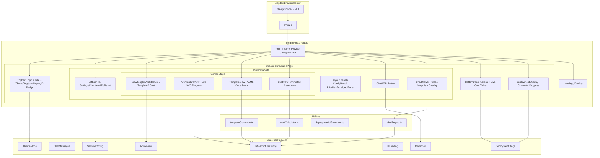

# Design Document: Infrastructure Studio React

## Overview

The Infrastructure Studio is a new React page added to the existing HiveMind web application at route `/studio`. It replicates and enhances the Streamlit-based `hivemind_web.py` as a modern single-page application using Ant Design (antd) for UI components, scoped via `ConfigProvider` so the rest of the app retains MUI.

Instead of a traditional two-column layout, the Studio uses a command-center-style layout designed to feel like a futuristic DevOps cockpit:

- **Center stage**: A large, animated architecture diagram dominates the viewport — the infrastructure is always visible and always live. This is the hero of the page.
- **Floating chat drawer**: The chat slides in from the right as a sleek drawer/panel that can be toggled open/closed with a floating action button (💬). When open, it overlays the right portion of the screen with a glass-morphism effect. When closed, the full diagram is visible.
- **Bottom dock**: A slim, always-visible dock bar at the bottom holds the action buttons (Generate, Validate, Deploy, View Deployments) plus a live cost ticker that updates in real-time as the infrastructure changes. Think macOS dock meets Bloomberg terminal.
- **Left rail**: A narrow icon rail (not a full sidebar) on the left edge with icons for Settings (⚙️), Priorities (🎯), API Config (🔌), and Reset (🔄). Clicking an icon opens a compact popover/flyout panel — no full sidebar eating screen space.
- **Top bar**: A minimal top bar with the HiveMind logo (small), page title, theme toggle (🌙/☀️), and a deployment ID badge. The 4px gold accent gradient sits above this.
- **Deployment overlay**: When deploying, a cinematic full-screen overlay with a dark backdrop shows the progress animation with glowing resource nodes lighting up as they're created, culminating in a confetti burst.

This layout keeps the infrastructure diagram as the focal point, makes the chat feel like an AI assistant you summon when needed, and turns the cost/template views into contextual panels rather than competing tabs.

The Architecture, Template, and Cost views are accessed via a floating segmented control (pill toggle) overlaid on the top-right of the center stage area. Switching between them animates the center content — Architecture shows the live diagram, Template shows the YAML in a code editor view, and Cost shows an animated breakdown with bar charts.

All infrastructure state flows through a single `useReducer`-managed state object, ensuring the chat engine, architecture diagram, template generator, and cost calculator stay synchronized regardless of which component triggers a change.

## Architecture



### Layout Wireframe

```
┌─────────────────────────────────────────────────────────────────────┐
│ ████ 4px gold accent gradient bar ██████████████████████████████████│
├──┬──────────────────────────────────────────────────────────────┬───┤
│  │  🐝 HiveMind  Infrastructure Studio    deploy-a1b2c3d4  🌙 │   │
├──┼──────────────────────────────────────────────────────────────┼───┤
│  │                                                              │   │
│⚙️│          ┌─────────────────────────────────┐                 │   │
│  │          │  Architecture │ Template │ Cost  │  ← pill toggle │   │
│🎯│          └─────────────────────────────────┘                 │   │
│  │                                                              │ 💬│
│🔌│     ┌──────────────────────────────────────────────┐         │   │
│  │     │                                              │         │   │
│🔄│     │         LIVE ARCHITECTURE DIAGRAM            │         │   │
│  │     │                                              │         │   │
│  │     │    ┌─────┐    ┌─────┐    ┌─────┐            │         │   │
│  │     │    │ ALB │───▶│ EC2 │───▶│ RDS │            │         │   │
│  │     │    └─────┘    └─────┘    └─────┘            │         │   │
│  │     │         within VPC 10.0.0.0/16               │         │   │
│  │     │                                              │         │   │
│  │     └──────────────────────────────────────────────┘         │   │
│  │                                                              │   │
├──┼──────────────────────────────────────────────────────────────┼───┤
│  │  🎨 Generate  │  🔍 Validate  │  🚀 Deploy  │  📊 View │ $33│   │
└──┴──────────────────────────────────────────────────────────────┴───┘
```

When the chat FAB (💬) is clicked, the drawer slides in from the right:

```
┌─────────────────────────────────────────────────────────────────────┐
│ ████ 4px gold accent gradient bar ██████████████████████████████████│
├──┬──────────────────────────────────────────────┬───────────────────┤
│  │  🐝 HiveMind  Infrastructure Studio     🌙  │  Chat with SysEng│
├──┼──────────────────────────────────────────────┤                   │
│  │                                              │  🤖 Hi! I'll help│
│⚙️│     ┌────────────────────────────────┐       │  you design AWS  │
│  │     │                                │       │  infrastructure. │
│🎯│     │    LIVE ARCHITECTURE DIAGRAM   │       │                  │
│  │     │    (slightly compressed)       │       │  What type of    │
│🔌│     │                                │       │  application?    │
│  │     └────────────────────────────────┘       │                  │
│🔄│                                              │  ┌──────────────┐│
│  │                                              │  │ Type here... ││
│  │                                              │  └──────────────┘│
├──┼──────────────────────────────────────────────┴───────────────────┤
│  │  🎨 Generate  │  🔍 Validate  │  🚀 Deploy  │  📊 View │ $33  │
└──┴──────────────────────────────────────────────────────────────────┘
```

### Key Architectural Decisions

1. **Command-center layout**: The architecture diagram is the hero element, always visible and always live. This makes the tool feel like a real-time infrastructure cockpit rather than a form-filling exercise.

2. **Floating chat drawer**: Instead of a permanent column, the chat is a slide-in drawer with glass-morphism styling. This gives the diagram maximum space and makes the AI assistant feel like a tool you summon, not a permanent fixture.

3. **Icon rail instead of sidebar**: A narrow icon rail with flyout popovers replaces the traditional sidebar. This saves horizontal space and feels more modern (similar to VS Code's activity bar or Figma's left rail).

4. **Bottom dock with live cost ticker**: The action bar doubles as a status bar with a real-time cost display. Users always see the financial impact of their design without switching tabs.

5. **Segmented view toggle**: Architecture/Template/Cost are views of the same center stage, not separate tabs in a panel. This makes the content feel unified and the transitions can be animated.

6. **Cinematic deployment overlay**: Instead of a progress section appended to the page, deployment takes over the screen with a dramatic animation — resource nodes glow as they're created, creating a satisfying visual experience.

7. **Ant Design scoped via ConfigProvider**: Only the Studio page and its children are wrapped in antd's `ConfigProvider`. The `NavigationBar` and all other routes remain MUI.

8. **useReducer for centralized state**: A single reducer manages all state including the new `activeView` and `chatOpen` fields. This ensures atomic state transitions.

9. **Pure utility functions**: `templateGenerator`, `costCalculator`, `deploymentIdGenerator`, and `chatEngine` are pure functions, independently testable with property-based tests.

## Components and Interfaces

### File Structure

```
hivemind_web/web/src/
├── pages/
│   └── InfrastructureStudioPage.tsx       # Main page with useReducer + layout
├── components/
│   └── studio/
│       ├── TopBar.tsx                      # Logo + title + theme toggle + deploy ID
│       ├── ThemeToggle.tsx                 # 🌙/☀️ switch
│       ├── LeftIconRail.tsx                # Narrow icon rail with flyout triggers
│       ├── ConfigFlyout.tsx                # Settings popover (repo URL, region, deploy ID)
│       ├── PrioritiesFlyout.tsx            # Priorities sliders popover
│       ├── ApiFlyout.tsx                   # API connection settings popover
│       ├── ViewToggle.tsx                  # Segmented control: Architecture/Template/Cost
│       ├── ArchitectureView.tsx            # Live SVG diagram + resource list
│       ├── ArchitectureDiagram.tsx         # SVG rendering of VPC/EC2/RDS/ALB topology
│       ├── TemplateView.tsx                # YAML code block + validate/download buttons
│       ├── CostView.tsx                    # Cost metric + animated breakdown
│       ├── ChatDrawer.tsx                  # Slide-in chat panel with glass morphism
│       ├── ChatMessage.tsx                 # Individual message bubble
│       ├── BottomDock.tsx                  # Action buttons + live cost ticker
│       ├── DeploymentOverlay.tsx           # Full-screen cinematic deploy progress
│       └── LoadingOverlay.tsx              # Blocking overlay during state transitions
├── utils/
│   └── studio/
│       ├── chatEngine.ts                   # Mock response generator
│       ├── costCalculator.ts               # Cost computation functions
│       ├── templateGenerator.ts            # CloudFormation YAML generator
│       ├── deploymentIdGenerator.ts        # Random ID generator
│       ├── studioReducer.ts               # useReducer reducer + action types
│       └── studioTypes.ts                 # All TypeScript interfaces
└── assets/ (served from project root assets/)
```

### TypeScript Interfaces

```typescript
// studioTypes.ts

export type InstanceType = 't3.micro' | 't3.small' | 't3.medium' | 't3.large';
export type DbEngine = 'postgres' | 'mysql';
export type DeploymentStage = 'planning' | 'deploying' | 'complete';
export type ThemeMode = 'dark' | 'light';
export type LlmProvider = 'bedrock' | 'claude' | 'chatgpt' | 'none';
export type ActiveView = 'architecture' | 'template' | 'cost';

export interface InfrastructureConfig {
  vpc: boolean;
  ec2: boolean;
  rds: boolean;
  alb: boolean;
  instance_type: InstanceType;
  db_engine: DbEngine;
}

export interface ApiSettings {
  bedrockEndpoint: string;
  bedrockModelId: string;
  claudeApiKey: string;
  chatgptApiKey: string;
  activeProvider: LlmProvider;
}

export interface SessionConfig {
  repoUrl: string;
  deploymentId: string;
  region: string;
  priorities: {
    security: number;
    costOptimization: number;
    performance: number;
    highAvailability: number;
  };
  apiSettings: ApiSettings;
}

export interface ChatMessage {
  id: string;
  role: 'user' | 'assistant';
  content: string;
  timestamp: number;
}

export interface DeploymentEvent {
  status: 'CREATE_IN_PROGRESS' | 'CREATE_COMPLETE';
  resource: string;
  progress: number;
}

export interface CostBreakdownItem {
  resource: string;
  monthlyCost: number;
}

export interface StudioState {
  infrastructure: InfrastructureConfig;
  messages: ChatMessage[];
  deploymentStage: DeploymentStage;
  sessionConfig: SessionConfig;
  themeMode: ThemeMode;
  isLoading: boolean;
  templateGenerated: boolean;
  activeView: ActiveView;
  chatOpen: boolean;
}

// Reducer actions
export type StudioAction =
  | { type: 'UPDATE_INFRASTRUCTURE'; payload: Partial<InfrastructureConfig> }
  | { type: 'ADD_MESSAGE'; payload: ChatMessage }
  | { type: 'SET_DEPLOYMENT_STAGE'; payload: DeploymentStage }
  | { type: 'UPDATE_SESSION_CONFIG'; payload: Partial<SessionConfig> }
  | { type: 'SET_THEME'; payload: ThemeMode }
  | { type: 'SET_LOADING'; payload: boolean }
  | { type: 'SET_TEMPLATE_GENERATED'; payload: boolean }
  | { type: 'SET_ACTIVE_VIEW'; payload: ActiveView }
  | { type: 'TOGGLE_CHAT' }
  | { type: 'RESET_SESSION' };
```

### Component Props Interfaces

```typescript
// TopBar
interface TopBarProps {
  deploymentId: string;
  themeMode: ThemeMode;
  onToggleTheme: () => void;
}

// LeftIconRail
interface LeftIconRailProps {
  onOpenConfig: () => void;
  onOpenPriorities: () => void;
  onOpenApi: () => void;
  onReset: () => void;
}

// ConfigFlyout
interface ConfigFlyoutProps {
  visible: boolean;
  onClose: () => void;
  sessionConfig: SessionConfig;
  onConfigChange: (config: Partial<SessionConfig>) => void;
  onRandomizeDeploymentId: () => void;
}

// PrioritiesFlyout
interface PrioritiesFlyoutProps {
  visible: boolean;
  onClose: () => void;
  priorities: SessionConfig['priorities'];
  onPrioritiesChange: (priorities: Partial<SessionConfig['priorities']>) => void;
}

// ApiFlyout
interface ApiFlyoutProps {
  visible: boolean;
  onClose: () => void;
  apiSettings: ApiSettings;
  onApiSettingsChange: (settings: Partial<ApiSettings>) => void;
}

// ViewToggle
interface ViewToggleProps {
  activeView: ActiveView;
  onViewChange: (view: ActiveView) => void;
}

// ArchitectureView
interface ArchitectureViewProps {
  infrastructure: InfrastructureConfig;
  totalCost: number;
  deploymentStage: DeploymentStage;
}

// TemplateView
interface TemplateViewProps {
  infrastructure: InfrastructureConfig;
  deploymentId: string;
  templateGenerated: boolean;
  onValidate: () => void;
}

// CostView
interface CostViewProps {
  infrastructure: InfrastructureConfig;
}

// ChatDrawer
interface ChatDrawerProps {
  open: boolean;
  onClose: () => void;
  messages: ChatMessage[];
  onSendMessage: (content: string) => void;
}

// BottomDock
interface BottomDockProps {
  templateGenerated: boolean;
  hasResources: boolean;
  totalCost: number;
  onGenerateTemplate: () => void;
  onValidate: () => void;
  onDeploy: () => void;
  onViewDeployments: () => void;
}

// DeploymentOverlay
interface DeploymentOverlayProps {
  stage: DeploymentStage;
  onComplete: () => void;
}

// LoadingOverlay
interface LoadingOverlayProps {
  visible: boolean;
}
```

### Utility Function Signatures

```typescript
// chatEngine.ts
export function generateAgentResponse(
  userInput: string,
  infrastructure: InfrastructureConfig,
  previousMessages: ChatMessage[]
): { response: string; infrastructureUpdates: Partial<InfrastructureConfig> | null };

// costCalculator.ts
export function calculateTotalCost(config: InfrastructureConfig): number;
export function getCostBreakdown(config: InfrastructureConfig): CostBreakdownItem[];

// templateGenerator.ts
export function generateTemplate(config: InfrastructureConfig): string;

// deploymentIdGenerator.ts
export function generateDeploymentId(): string;

// studioReducer.ts
export function studioReducer(state: StudioState, action: StudioAction): StudioState;
export const INITIAL_STATE: StudioState;
```

## Data Models

### Infrastructure Config Defaults

```typescript
const DEFAULT_INFRASTRUCTURE: InfrastructureConfig = {
  vpc: true,
  ec2: true,
  rds: true,
  alb: true,
  instance_type: 't3.small',
  db_engine: 'postgres',
};
```

### Cost Rate Table

```typescript
const EC2_COSTS: Record<InstanceType, number> = {
  't3.micro': 7.59,
  't3.small': 15.18,
  't3.medium': 30.37,
  't3.large': 60.74,
};

const RESOURCE_COSTS = {
  vpc: 0.00,
  rds_instance: 12.41,
  rds_storage: 2.30,
  alb_base: 16.20,
  alb_lcu: 5.84,
} as const;
```

### Deployment Events Sequence

```typescript
const DEPLOYMENT_EVENTS: DeploymentEvent[] = [
  { status: 'CREATE_IN_PROGRESS', resource: 'VPC', progress: 10 },
  { status: 'CREATE_COMPLETE', resource: 'VPC', progress: 20 },
  { status: 'CREATE_IN_PROGRESS', resource: 'InternetGateway', progress: 30 },
  { status: 'CREATE_COMPLETE', resource: 'InternetGateway', progress: 40 },
  { status: 'CREATE_IN_PROGRESS', resource: 'PublicSubnet1', progress: 50 },
  { status: 'CREATE_COMPLETE', resource: 'PublicSubnet1', progress: 60 },
  { status: 'CREATE_IN_PROGRESS', resource: 'ApplicationInstance', progress: 70 },
  { status: 'CREATE_COMPLETE', resource: 'ApplicationInstance', progress: 85 },
  { status: 'CREATE_COMPLETE', resource: 'Stack', progress: 100 },
];
```

### AWS Regions List

```typescript
const AWS_REGIONS: string[] = [
  'us-east-1', 'us-east-2', 'us-west-1', 'us-west-2',
  'af-south-1', 'ap-east-1', 'ap-south-1', 'ap-south-2',
  'ap-northeast-1', 'ap-northeast-2', 'ap-northeast-3',
  'ap-southeast-1', 'ap-southeast-2', 'ap-southeast-3', 'ap-southeast-4',
  'ca-central-1',
  'eu-central-1', 'eu-central-2', 'eu-west-1', 'eu-west-2', 'eu-west-3',
  'eu-south-1', 'eu-south-2', 'eu-north-1',
  'me-south-1', 'me-central-1',
  'sa-east-1',
];
```

### Chat Engine Response Logic

The `generateAgentResponse` function implements keyword-based pattern matching:

```
Input contains "web" or "api" → set vpc/ec2/alb=true, recommend architecture, ask about DB
Input is "yes" AND previous msg mentions "database" → set rds=true, ask about instance type
Input contains "t3.micro|t3.small|t3.medium|t3.large" → set instance_type, confirm design
Input is "no" AND previous msg mentions "database" → confirm design without RDS
Fallback → generic help message
```

The function returns both the response string and any infrastructure updates, keeping the chat engine pure (no side effects).

### Mock Stack Outputs

```typescript
const MOCK_STACK_OUTPUTS = {
  VpcId: 'vpc-0abc123def456',
  PublicSubnet1Id: 'subnet-0abc123',
  ApplicationInstanceId: 'i-0abc123def456',
  ApplicationInstancePublicIp: '54.123.45.67',
  ApplicationLoadBalancerDNSName: 'deploy-alb-123456.us-east-1.elb.amazonaws.com',
};
```

### Glass Morphism Chat Drawer Styling

```css
.chat-drawer {
  background: rgba(26, 26, 26, 0.85);
  backdrop-filter: blur(20px);
  -webkit-backdrop-filter: blur(20px);
  border-left: 1px solid rgba(212, 175, 55, 0.2);
  box-shadow: -8px 0 32px rgba(0, 0, 0, 0.5);
}
```

### Bottom Dock Styling

```css
.bottom-dock {
  background: linear-gradient(180deg, rgba(26, 26, 26, 0.95) 0%, rgba(10, 10, 10, 1) 100%);
  backdrop-filter: blur(10px);
  border-top: 1px solid #2a2a2a;
  box-shadow: 0 -4px 20px rgba(0, 0, 0, 0.5);
}

.cost-ticker {
  font-variant-numeric: tabular-nums;
  color: #D4AF37;
  font-weight: 700;
  font-size: 1.1rem;
  animation: pulse 2s ease-in-out infinite;
}
```

### Deployment Overlay Animation Concept

During deployment, each resource node in the diagram glows as it transitions through CREATE_IN_PROGRESS (pulsing amber) → CREATE_COMPLETE (solid green). The overlay uses a dark backdrop (rgba(0,0,0,0.9)) with the diagram centered and enlarged. Progress text and a progress bar appear below the diagram. On completion, confetti particles burst from the center.

## Correctness Properties

*A property is a characteristic or behavior that should hold true across all valid executions of a system — essentially, a formal statement about what the system should do. Properties serve as the bridge between human-readable specifications and machine-verifiable correctness guarantees.*

The following properties are derived from the acceptance criteria prework analysis. Each property is universally quantified and references the requirements it validates.

### Property 1: Reset produces default state

*For any* StudioState (regardless of how many messages, what infrastructure config, or what deployment stage), dispatching a RESET_SESSION action SHALL produce a state equal to INITIAL_STATE (with a fresh deployment ID).

**Validates: Requirements 2.8, 11.5**

### Property 2: Message submission grows history by exactly two

*For any* valid non-empty user message string and any current StudioState, submitting the message through the chat engine SHALL result in the messages array length increasing by exactly 2 (one user message + one assistant response).

**Validates: Requirements 3.4**

### Property 3: Web/API keywords enable infrastructure flags

*For any* string containing the substring "web" or "api" (case-insensitive), when passed to `generateAgentResponse`, the returned `infrastructureUpdates` SHALL set `vpc`, `ec2`, and `alb` to `true`.

**Validates: Requirements 3.5**

### Property 4: Instance type keyword updates config

*For any* string containing one of the valid instance type identifiers ("t3.micro", "t3.small", "t3.medium", "t3.large"), when passed to `generateAgentResponse`, the returned `infrastructureUpdates` SHALL set `instance_type` to the matching value.

**Validates: Requirements 3.7**

### Property 5: Non-matching input returns help response

*For any* string that does not contain "web", "api", "yes", "no", or any "t3." instance type substring, and where the previous message does not mention "database", when passed to `generateAgentResponse`, the returned response SHALL contain the help text listing available topics.

**Validates: Requirements 3.9**

### Property 6: Template contains required YAML sections with correct instance type

*For any* valid InfrastructureConfig, the output of `generateTemplate(config)` SHALL contain the strings "AWSTemplateFormatVersion", "Description", "Parameters", "Resources", "Outputs", and the config's `instance_type` value within the Parameters section.

**Validates: Requirements 5.2, 13.2**

### Property 7: Template YAML round-trip preserves InstanceType

*For any* valid InfrastructureConfig, generating a YAML template via `generateTemplate(config)` and then parsing the resulting YAML string back into an object SHALL produce a parsed object where `Parameters.InstanceType.Default` equals `config.instance_type`.

**Validates: Requirements 13.3**

### Property 8: Cost total equals sum of breakdown

*For any* valid InfrastructureConfig, `calculateTotalCost(config)` SHALL equal the sum of all `monthlyCost` values in the array returned by `getCostBreakdown(config)`.

**Validates: Requirements 6.4, 14.2**

### Property 9: Cost matches rate table and is non-negative

*For any* valid InfrastructureConfig, `calculateTotalCost(config)` SHALL return a non-negative number, and the individual costs in `getCostBreakdown(config)` SHALL match the defined rate table (VPC=$0.00, EC2 per instance type, RDS=$12.41+$2.30, ALB=$16.20+$5.84) for each enabled resource.

**Validates: Requirements 6.3, 14.3**

### Property 10: Deployment ID matches format regex

*For any* invocation of `generateDeploymentId()`, the returned string SHALL match the regex `^deploy-[a-z0-9]{8}$`.

**Validates: Requirements 15.1, 15.2, 15.3**

## Error Handling

### Chat Engine Errors

- If the user submits an empty or whitespace-only message, the chat drawer ignores it and does not invoke the chat engine.
- If the chat engine encounters an unexpected input pattern, it falls back to the generic help response (Requirement 3.9). There is no error state — the fallback is the default behavior.

### Template Generation Errors

- The template generator is a pure function operating on a well-typed InfrastructureConfig. Invalid configs are prevented by TypeScript's type system. No runtime errors are expected.
- If YAML serialization were to fail (unlikely with string interpolation), the Template View should display an error message in place of the code block.

### Cost Calculation Errors

- The cost calculator is a pure function with a fixed rate table. No external dependencies or failure modes exist. TypeScript types prevent invalid inputs.

### Deployment Simulation Errors

- The deployment simulation is a local timer-based animation. If the component unmounts during simulation (e.g., user navigates away or closes the overlay), the timer should be cleaned up via `useEffect` cleanup to prevent memory leaks and state updates on unmounted components.

### API Settings Errors

- API settings fields are stored in state but not actively used in this mock implementation. Validation of API keys and endpoints is deferred to when real API integration is implemented. For now, the fields accept any string input.

### Loading Overlay

- The loading overlay is a safety mechanism. If a state transition completes faster than expected, the overlay still disappears (it's driven by the `isLoading` state flag, not a timer).

### Theme Toggle

- Theme switching is handled entirely by Ant Design's ConfigProvider algorithm swap. No error states are possible — the toggle simply flips between `darkAlgorithm` and `defaultAlgorithm`.

### Chat Drawer

- The chat drawer can be opened/closed at any time without affecting state. Messages persist when the drawer is closed and reopened.

## Testing Strategy

### Testing Framework

The project already uses:
- **vitest** for test runner
- **@testing-library/react** for component testing
- **fast-check** for property-based testing
- **jsdom** as the test environment

All new tests follow the same patterns established in the existing codebase.

### Dual Testing Approach

Testing uses both unit tests and property-based tests as complementary strategies:

- **Unit tests**: Verify specific examples, edge cases, error conditions, and UI rendering
- **Property tests**: Verify universal properties across randomly generated inputs using fast-check

### Property-Based Testing Configuration

- Library: **fast-check** (already installed, v4.5.3)
- Minimum iterations: **100** per property test
- Each property test references its design document property via comment tag
- Tag format: `Feature: infrastructure-studio-react, Property {number}: {property_text}`

### Test File Organization

```
hivemind_web/web/src/
├── utils/studio/
│   ├── chatEngine.test.ts                  # Unit tests for chat engine
│   ├── chatEngine.property.test.ts         # Property tests (Properties 2-5)
│   ├── costCalculator.test.ts              # Unit tests for cost calculator
│   ├── costCalculator.property.test.ts     # Property tests (Properties 8-9)
│   ├── templateGenerator.test.ts           # Unit tests for template generator
│   ├── templateGenerator.property.test.ts  # Property tests (Properties 6-7)
│   ├── deploymentIdGenerator.test.ts       # Unit tests for ID generator
│   ├── deploymentIdGenerator.property.test.ts # Property test (Property 10)
│   ├── studioReducer.test.ts              # Unit tests for reducer
│   └── studioReducer.property.test.ts     # Property test (Property 1)
├── components/studio/
│   ├── TopBar.test.tsx                     # Unit tests
│   ├── LeftIconRail.test.tsx               # Unit tests
│   ├── ViewToggle.test.tsx                 # Unit tests
│   ├── ArchitectureView.test.tsx           # Unit tests
│   ├── TemplateView.test.tsx               # Unit tests
│   ├── CostView.test.tsx                   # Unit tests
│   ├── ChatDrawer.test.tsx                 # Unit tests
│   ├── BottomDock.test.tsx                 # Unit tests
│   ├── DeploymentOverlay.test.tsx          # Unit tests
│   └── LoadingOverlay.test.tsx             # Unit tests
└── pages/
    └── InfrastructureStudioPage.test.tsx   # Integration tests
```

### Property Test Mapping

| Property | Test File | What It Tests |
|----------|-----------|---------------|
| Property 1 | studioReducer.property.test.ts | Reset always produces default state |
| Property 2 | chatEngine.property.test.ts | Message count grows by 2 |
| Property 3 | chatEngine.property.test.ts | web/api keywords set flags |
| Property 4 | chatEngine.property.test.ts | Instance type keyword updates config |
| Property 5 | chatEngine.property.test.ts | Non-matching input returns help |
| Property 6 | templateGenerator.property.test.ts | YAML contains required sections |
| Property 7 | templateGenerator.property.test.ts | YAML round-trip preserves InstanceType |
| Property 8 | costCalculator.property.test.ts | Total equals sum of breakdown |
| Property 9 | costCalculator.property.test.ts | Costs match rate table, non-negative |
| Property 10 | deploymentIdGenerator.property.test.ts | ID matches regex format |

### Unit Test Coverage

Unit tests focus on:
- Component rendering with various props
- User interaction flows (click handlers, input changes, drawer open/close)
- Edge cases (empty config, all resources disabled, empty messages)
- View toggle switching between Architecture/Template/Cost
- Chat drawer open/close state persistence
- Flyout panel open/close behavior
- Bottom dock cost ticker display
- Deployment overlay lifecycle (start, progress, complete, confetti)
- Theme toggle switching
- Loading overlay visibility and interaction blocking

### Test Execution

```bash
# Run all tests
cd hivemind_web/web && npm test -- --silent

# Run only studio tests
cd hivemind_web/web && npx vitest run --silent src/**/*studio*

# Run only property tests
cd hivemind_web/web && npx vitest run --silent src/**/*.property.test.*
```
