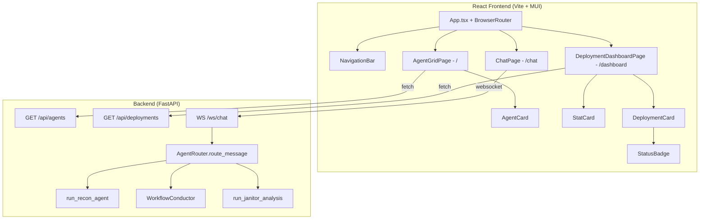

# Design Document: Legacy WebGUI React Migration

## Overview

This design migrates the remaining legacy HiveMind web GUI pages into the existing React + TypeScript + MUI frontend, adds client-side routing with `react-router-dom`, wires Strands agents to Amazon Bedrock for real chat responses, and cleans up legacy/orphaned files from the repository.

The existing React app at `hivemind_web/web/src/` currently only renders `ChatPage`. This migration adds two new pages (`AgentGridPage`, `DeploymentDashboardPage`), a shared `NavigationBar` component, and a `BrowserRouter` setup in `App.tsx`. On the backend, `AgentRouter.route_message` is updated to actually invoke the loaded Strands agents instead of returning canned responses.

The backend already has a SPA catch-all route (`spa_catch_all` in `server.py`) that serves `index.html` for any non-API, non-static route, so client-side routing works without backend changes.

## Architecture



## Components and Interfaces

### New React Components

#### `NavigationBar`
- Location: `hivemind_web/web/src/components/NavigationBar.tsx`
- MUI `AppBar` with gradient logo text, tagline, and navigation links
- Uses `useLocation()` from react-router-dom to highlight the active link
- Links: Agents (`/`), Chat (`/chat`), Deployments (`/dashboard`)

#### `AgentGridPage`
- Location: `hivemind_web/web/src/pages/AgentGridPage.tsx`
- Fetches `GET /api/agents` on mount
- Renders a responsive MUI `Grid` of `AgentCard` components
- Shows loading skeleton, empty state, and error state with retry

#### `AgentCard`
- Location: `hivemind_web/web/src/components/AgentCard.tsx`
- MUI `Card` with hover elevation, gradient top border on hover
- Displays: icon, name, role (uppercase, primary color), description, up to 3 capabilities with "+N more" overflow
- `onClick` navigates to `/chat?agent={agentId}` via `useNavigate()`

#### `DeploymentDashboardPage`
- Location: `hivemind_web/web/src/pages/DeploymentDashboardPage.tsx`
- Fetches `GET /api/deployments` on mount
- Computes stats from the deployment array using `computeDeploymentStats()`
- Renders 4 `StatCard` components and a list of `DeploymentCard` components
- Refresh button re-fetches data
- Shows loading, empty, and error states

#### `StatCard`
- Location: `hivemind_web/web/src/components/StatCard.tsx`
- MUI `Card` displaying an icon (emoji), a count (large typography), and a label

#### `DeploymentCard`
- Location: `hivemind_web/web/src/components/DeploymentCard.tsx`
- MUI `Card` with hover border highlight
- Displays: deployment ID (monospace), `StatusBadge`, repo URL, description, timestamps
- `onClick` navigates to `/chat?agent=conductor&deployment={deploymentId}`

#### `StatusBadge`
- Location: `hivemind_web/web/src/components/StatusBadge.tsx`
- MUI `Chip` component with color mapped from deployment status
- Pure function: `getStatusColor(status: string) => 'success' | 'error' | 'warning'`

### Modified Components

#### `App.tsx`
- Wraps content in `BrowserRouter` with `Routes`
- Route `/` → `AgentGridPage`
- Route `/chat` → `ChatPage`
- Route `/dashboard` → `DeploymentDashboardPage`
- Route `*` → `Navigate to="/"`
- `NavigationBar` rendered above routes

#### `ChatPage.tsx`
- Reads `agent` and `deployment` query params from URL via `useSearchParams()`
- Pre-selects agent from `agent` param
- Passes `deployment` context when chatting with conductor

### Backend Changes

#### `AgentRouter.route_message` (Python)
- Replace canned response with actual agent invocation
- For `recon`: call `run_recon_agent(message)` and extract response text
- For `conductor`: call `conductor.process_message(message, context)` or equivalent
- For `janitor`: call `run_janitor_analysis(message)` and extract response text
- Wrap each call in try/except, return error response on failure
- Unimplemented agents return "not available" message (existing behavior for unknown agents)

### Utility Functions

#### `computeDeploymentStats(deployments: Deployment[]): DeploymentStats`
- Location: `hivemind_web/web/src/utils/deploymentStats.ts`
- Pure function, no side effects
- Computes: `{ total, active, failed, inProgress }`
- `active` = count where status is "completed" or "deployed"
- `failed` = count where status is "failed"
- `inProgress` = count where status is "deploying" or "pending"

#### `getStatusColor(status: string): 'success' | 'error' | 'warning'`
- Location: `hivemind_web/web/src/utils/statusColor.ts`
- Pure function mapping status strings to MUI color names
- "completed" | "deployed" → "success"
- "failed" → "error"
- "deploying" | "pending" | default → "warning"

## Data Models

### New TypeScript Interfaces

```typescript
// Add to types.ts

export interface Deployment {
  deployment_id: string;
  status: 'completed' | 'deployed' | 'failed' | 'deploying' | 'pending';
  repo_url: string | null;
  description: string | null;
  started_at: string | null;
  completed_at: string | null;
}

export interface DeploymentStats {
  total: number;
  active: number;
  failed: number;
  inProgress: number;
}

export interface DeploymentsApiResponse {
  deployments: Deployment[];
  message?: string;
}

export interface AgentsApiResponse {
  agents: AgentInfo[];
}
```

### Existing Interfaces (unchanged)

- `AgentInfo` — already has `id`, `name`, `role`, `icon`, `capabilities`, `status`
- `ChatMessage`, `SessionMetrics`, `ChatState` — unchanged

### API Response Shapes

`GET /api/agents`:
```json
{
  "agents": [
    {
      "id": "recon",
      "name": "Recon Agent",
      "role": "Repository Analysis",
      "description": "Analyzes GitHub repositories...",
      "icon": "🔍",
      "capabilities": ["Detect programming languages...", ...]
    }
  ]
}
```

`GET /api/deployments`:
```json
{
  "deployments": [
    {
      "deployment_id": "dep-123",
      "status": "completed",
      "repo_url": "https://github.com/...",
      "description": "Deploy web app",
      "started_at": "2025-01-15T10:00:00Z",
      "completed_at": "2025-01-15T10:05:00Z"
    }
  ]
}
```


## Correctness Properties

*A property is a characteristic or behavior that should hold true across all valid executions of a system — essentially, a formal statement about what the system should do. Properties serve as the bridge between human-readable specifications and machine-verifiable correctness guarantees.*

### Property 1: Agent card capability overflow display

*For any* agent with N capabilities (where N >= 0), the AgentCard component SHALL display min(N, 3) capability items, and if N > 3, display a "+{N-3} more..." indicator. The total visible capability count plus the overflow number SHALL equal N.

**Validates: Requirements 1.2**

### Property 2: Deployment stats computation invariant

*For any* array of Deployment objects, `computeDeploymentStats` SHALL return a `DeploymentStats` where:
- `total` equals the array length
- `active` equals the count of deployments with status "completed" or "deployed"
- `failed` equals the count of deployments with status "failed"
- `inProgress` equals the count of deployments with status "deploying" or "pending"
- `active + failed + inProgress` is less than or equal to `total`

**Validates: Requirements 2.1, 7.1, 7.2, 7.3, 7.4, 7.5**

### Property 3: Deployment card field completeness

*For any* Deployment object with non-null fields, the rendered DeploymentCard SHALL contain the deployment_id, status text, repo_url, description, and formatted started_at timestamp in its output.

**Validates: Requirements 2.3**

### Property 4: Status color mapping correctness

*For any* status string, `getStatusColor` SHALL return:
- "success" if status is "completed" or "deployed"
- "error" if status is "failed"
- "warning" for all other strings (including "deploying", "pending", and any unrecognized value)

**Validates: Requirements 3.1, 3.2, 3.3, 3.4**

### Property 5: Unknown route redirect

*For any* URL path that is not `/`, `/chat`, or `/dashboard`, the Router SHALL redirect to `/` (the AgentGridPage).

**Validates: Requirements 5.4**

### Property 6: Agent router error handling

*For any* agent ID and any exception raised during agent invocation, `route_message` SHALL return a dictionary with `"status": "error"` and a `"message"` field containing a non-empty string describing the error.

**Validates: Requirements 6.4**

### Property 7: Unknown agent returns unavailable

*For any* agent ID string that is not in the set of implemented agents ("recon", "conductor", "janitor"), `route_message` SHALL return a response with `"status": "error"` and a message indicating the agent is not available.

**Validates: Requirements 6.5**

## Error Handling

### Frontend Error Handling

- **API fetch failures**: Each page (`AgentGridPage`, `DeploymentDashboardPage`) wraps fetch calls in try/catch. On failure, the page displays an error `Alert` with a retry button. The error state is stored in component state (`error: string | null`).
- **Empty data**: Empty arrays from the API render a friendly empty-state message instead of a blank page.
- **Invalid query params**: If `?agent=` contains an unknown agent ID, `ChatPage` falls back to the default agent (existing behavior in `resolveInitialAgent`).
- **Route not found**: The catch-all `*` route redirects to `/`.

### Backend Error Handling

- **Agent load failure**: `_load_agent` raises `ValueError` if the agent module can't be imported. `route_message` catches this and returns `{"status": "error", "message": "..."}`.
- **Agent invocation failure**: Any exception from the Strands agent call is caught in `route_message`, logged with `logger.error(..., exc_info=True)`, and returned as an error response.
- **Unimplemented agents**: Agents not in the `_load_agent` switch (compiler, provisioner, deployer, sheriff, qa, ops, medic) raise `ValueError("Agent {id} not yet available for chat")`.

## Testing Strategy

### Frontend Testing (TypeScript — Vitest + fast-check)

**Property-Based Tests** (fast-check, minimum 100 iterations each):
- Property 1: `AgentCard.property.test.tsx` — generate agents with random capability arrays, verify overflow logic
- Property 2: `deploymentStats.property.test.ts` — generate random deployment arrays, verify all stat invariants
- Property 3: `DeploymentCard.property.test.tsx` — generate random deployments, verify rendered fields
- Property 4: `statusColor.property.test.ts` — generate random strings, verify color mapping
- Property 5: `App.property.test.tsx` — generate random URL paths, verify redirect behavior

Each property test is tagged: `Feature: legacy-webgui-react-migration, Property N: {title}`

**Unit Tests** (vitest + @testing-library/react):
- `AgentGridPage.test.tsx` — mock fetch, test loading/empty/error states
- `DeploymentDashboardPage.test.tsx` — mock fetch, test loading/empty/error/refresh states
- `NavigationBar.test.tsx` — test link rendering and active state
- `StatusBadge.test.tsx` — test specific known status values

### Backend Testing (Python — pytest + hypothesis)

**Property-Based Tests** (hypothesis, minimum 100 iterations):
- Property 6: `test_agent_router_properties.py` — generate random exceptions, verify error response shape
- Property 7: `test_agent_router_properties.py` — generate random unknown agent IDs, verify unavailable response

**Unit Tests** (pytest):
- `test_agent_router.py` — mock Strands agent functions, verify `route_message` calls the correct agent for recon/conductor/janitor
- Test that error responses have the correct structure

### Test Commands

```bash
# Frontend
cd hivemind_web/web && npm test -- --silent

# Backend
pytest tests/ -q
```
