# Design Document: Studio V2 Overhaul

## Overview

The Studio V2 Overhaul transforms the HiveMind web application from a multi-page app with a Studio side-feature into a unified, Studio-centric workspace. The overhaul touches every layer of the frontend:

1. **Full Ant Design adoption**: MUI is removed entirely. The Ant Design ConfigProvider wraps the whole app, not just the Studio page. NavigationBar, AgentGridPage, ChatPage, and DeploymentDashboardPage are either reimplemented with antd or consolidated into Studio views.

2. **Real LLM chat**: The mock `chatEngine.ts` keyword matcher is replaced by the existing WebSocket connection at `/ws/chat`. The backend already routes messages to Strands agents (recon, conductor, janitor) via `agent_router.py`. The frontend needs to wire the Studio chat drawer to `useWebSocket` instead of calling `generateAgentResponse()` locally. Streaming support requires a new `stream` message type on the WebSocket protocol.

3. **Studio hub with views**: The center stage area gains a top-level View_Switcher (Agents / Chat / Deployments / Logs). The existing Architecture/Template/Cost pill toggle becomes a sub-navigation within the Chat view's infrastructure design context. Standalone pages are removed; their routes redirect to `/studio`.

4. **Light mode rework**: A complete set of Ant Design token overrides for `defaultAlgorithm` that ensures 4.5:1+ contrast ratios. Every custom-styled component (chat drawer, bottom dock, deployment overlay, icon rail) gets explicit light-mode CSS variants.

5. **Theme presets**: A `ThemeContext` provides mode + preset to the entire app. Six named presets define `colorPrimary` and related tokens. Presets persist to localStorage independently of dark/light mode.

6. **Visual polish**: Glass morphism, 200-300ms view transitions, hover micro-interactions, skeleton loading states, Inter font stack, 8px grid spacing, cinematic deployment overlay.

7. **AWS Log Reader**: A new Logs view fetches CloudWatch log groups/events via backend API endpoints. Real-time streaming drives deployment overlay animations with live CloudFormation events.

8. **Landing page + tutorial**: First-visit users see an animated logo + typewriter tagline, then a step-by-step walkthrough. Completion flag persists to localStorage.

9. **FumaDocs integration**: Documentation at `/docs` route, built with FumaDocs, styled with the active theme, covering all Studio features.

## Architecture

```mermaid
graph TB
    subgraph "App.tsx BrowserRouter"
        AGP[Antd_Global_Provider<br/>ConfigProvider + ThemeContext]
        ROUTES[Routes]
    end

    subgraph "Landing Route /"
        LP[LandingPage<br/>Logo Animation + Tutorial]
    end

    subgraph "Studio Route /studio"
        subgraph "StudioLayout"
            TOP[TopBar: Logo + Nav + ThemeToggle + Docs + Settings]
            
            subgraph "Main Viewport"
                RAIL[LeftIconRail<br/>Settings/API/Reset/Logs]
                
                subgraph "Center Stage"
                    VS[ViewSwitcher: Agents / Chat / Deployments / Logs]
                    
                    AV[AgentsView — Agent Grid]
                    CV_MAIN[ChatView — Real LLM Chat + Infra Sub-views]
                    DV[DeploymentsView — History + Detail]
                    LV[LogsView — CloudWatch Browser]
                end
            end
            
            DOCK[BottomDock: Actions + Live Cost Ticker]
            DEPLOY_OV[DeploymentOverlay — Live CF Events]
            SETTINGS[UserSettingsPanel — Theme Presets]
        end
    end

    subgraph "Docs Route /docs"
        FUMA[FumaDocs Documentation]
    end

    subgraph "Services"
        CS[ChatService<br/>WebSocket + Streaming]
        TS[ThemeService<br/>Mode + Presets + localStorage]
        LS[LogService<br/>CloudWatch API]
        DS_SVC[DeploymentService<br/>API + Streaming]
    end

    subgraph "Backend (existing)"
        WS[WebSocket /ws/chat]
        API_AGENTS[GET /api/agents]
        API_DEPLOY[GET /api/deployments]
        API_LOGS[GET /api/logs — new]
        AR[AgentRouter<br/>Strands Agents]
    end

    AGP --> ROUTES
    ROUTES --> LP
    ROUTES --> VS
    ROUTES --> FUMA

    CV_MAIN --> CS
    CS --> WS
    WS --> AR

    AV --> API_AGENTS
    DV --> API_DEPLOY
    DV --> DS_SVC
    LV --> API_LOGS
    LV --> LS

    TOP --> TS
    SETTINGS --> TS
```



### Layout Wireframe — Studio Hub

```
┌─────────────────────────────────────────────────────────────────────┐
│ ████ accent gradient bar (color from active Theme_Preset) █████████│
├──┬──────────────────────────────────────────────────────────────┬───┤
│  │  🐝 HiveMind Studio    [Agents|Chat|Deploy|Logs]   📖 ⚙️ 🌙│   │
├──┼──────────────────────────────────────────────────────────────┼───┤
│  │                                                              │   │
│⚙️│  ┌──────────────────────────────────────────────────────┐    │   │
│  │  │                                                      │    │   │
│🔌│  │              ACTIVE VIEW CONTENT                     │    │ 💬│
│  │  │                                                      │    │   │
│📋│  │  (Agents grid / Chat + Infra / Deployments / Logs)   │    │   │
│  │  │                                                      │    │   │
│🔄│  │                                                      │    │   │
│  │  └──────────────────────────────────────────────────────┘    │   │
│  │                                                              │   │
├──┼──────────────────────────────────────────────────────────────┼───┤
│  │  🎨 Generate │ 🔍 Validate │ 🚀 Deploy │ 📊 View  │ $33.18│   │
└──┴──────────────────────────────────────────────────────────────┴───┘
```

### Landing Page Flow


Tutorial steps: (1) Agents — meet your AI team, (2) Chat — talk to agents, (3) Infrastructure Design — build AWS architectures, (4) Deployments — track and manage, (5) Logs — browse CloudWatch, (6) Themes — customize your look, (7) Docs — learn more.

### Key Architectural Decisions

1. **Ant Design globally, MUI removed**: The `Antd_Global_Provider` wraps `<App>` at the top level. No more scoped ConfigProvider on Studio alone. The MUI ThemeProvider and all `@mui/*` imports are deleted. This simplifies theming and eliminates the dual-library CSS conflicts that caused the light mode readability issues.

2. **ThemeContext for mode + presets**: A dedicated React context (`ThemeContext`) manages `themeMode` (dark/light) and `activePreset` (color palette name). It computes the Ant Design `theme` prop by combining the algorithm with preset tokens. Both values persist to localStorage independently. This replaces the `SET_THEME` action in the Studio reducer — theme is now app-global, not Studio-local.

3. **Real chat via existing WebSocket**: The `useWebSocket` hook already handles connection, reconnection, message routing, and agent switching. The Chat_View wires directly to it instead of calling `generateAgentResponse()`. The mock `chatEngine.ts` is retained as a fallback when the WebSocket is disconnected (offline mode). Streaming requires extending the WebSocket protocol with a `stream_start` / `stream_chunk` / `stream_end` message flow.

4. **View_Switcher replaces routing**: Instead of separate React Router routes for Agents/Chat/Deployments, the Studio uses an internal View_Switcher (Ant Design Segmented). This keeps the Studio as a single-page workspace. Deep-link routes (`/studio/agents`, `/studio/chat`, `/studio/deployments`, `/studio/logs`) map to View_Switcher state via URL params.

5. **Logs via new backend endpoint**: A new `/api/logs` REST endpoint (and optionally a WebSocket subscription) is added to the Python backend. It proxies CloudWatch Logs API calls using the user's configured AWS credentials. The frontend Log_Viewer component handles filtering, time-range selection, and auto-scroll.

6. **FumaDocs as a sub-app**: FumaDocs is integrated as a separate route (`/docs`) within the same Vite build. It uses MDX content files in a `docs/` directory. The FumaDocs theme is configured to respect the active Ant Design theme tokens for visual consistency.

7. **Landing page as a route guard**: The landing page is a route component at `/` that checks localStorage for the tutorial completion flag. If present, it redirects to `/studio`. If not, it renders the animation sequence and tutorial. This is a simple client-side guard, no backend involvement.

8. **Standalone pages consolidated**: `AgentGridPage`, `ChatPage`, and `DeploymentDashboardPage` are removed. Their functionality is absorbed into `AgentsView`, `ChatView`, and `DeploymentsView` within the Studio. The existing component logic (agent cards, chat messages, deployment cards) is reused but restyled with Ant Design.

## Components and Interfaces

### File Structure

```
hivemind_web/web/src/
├── App.tsx                                    # Root: ThemeProvider + Antd ConfigProvider + Routes
├── main.tsx                                   # Entry point
├── contexts/
│   └── ThemeContext.tsx                        # ThemeMode + ThemePreset context + localStorage persistence
├── services/
│   ├── chatService.ts                         # WebSocket chat integration (replaces mock chatEngine for live mode)
│   ├── logService.ts                          # CloudWatch log fetching + streaming
│   └── deploymentService.ts                   # Deployment API + real-time event subscription
├── hooks/
│   ├── useWebSocket.ts                        # Existing — reused for chat + streaming
│   ├── useTheme.ts                            # Hook wrapping ThemeContext consumption
│   └── useTutorial.ts                         # Tutorial state + localStorage flag management
├── pages/
│   ├── LandingPage.tsx                        # Animated logo + tutorial walkthrough
│   ├── StudioPage.tsx                         # Main hub: ViewSwitcher + all views + layout
│   └── DocsLayout.tsx                         # FumaDocs wrapper with theme integration
├── components/
│   ├── layout/
│   │   ├── TopBar.tsx                         # Logo + ViewSwitcher + Docs/Settings/Theme icons
│   │   ├── LeftIconRail.tsx                   # Narrow icon rail (settings, API, reset, logs)
│   │   ├── BottomDock.tsx                     # Action buttons + live cost ticker
│   │   └── NavigationBar.tsx                  # Reimplemented with antd Menu (used in TopBar)
│   ├── studio/
│   │   ├── ViewSwitcher.tsx                   # Ant Design Segmented: Agents/Chat/Deployments/Logs
│   │   ├── AgentsView.tsx                     # Agent grid with AgentCard components
│   │   ├── AgentCard.tsx                      # Individual agent: name, icon, role, status, capabilities
│   │   ├── ChatView.tsx                       # Real LLM chat + infrastructure sub-views
│   │   ├── ChatMessage.tsx                    # Message bubble with streaming support
│   │   ├── ChatInput.tsx                      # Input with send button, agent selector, connection status
│   │   ├── InfraSubViews.tsx                  # Architecture/Template/Cost sub-navigation within ChatView
│   │   ├── ArchitectureView.tsx               # Existing — restyled with antd
│   │   ├── ArchitectureDiagram.tsx            # Existing — unchanged
│   │   ├── TemplateView.tsx                   # Existing — restyled with antd
│   │   ├── CostView.tsx                       # Existing — restyled with antd
│   │   ├── DeploymentsView.tsx                # Deployment list + detail panels
│   │   ├── DeploymentRecord.tsx               # Single deployment row with expandable detail
│   │   ├── LogsView.tsx                       # CloudWatch log browser
│   │   ├── LogViewer.tsx                      # Scrollable monospace log display with filtering
│   │   ├── DeploymentOverlay.tsx              # Cinematic overlay — now with live CF events
│   │   └── LoadingOverlay.tsx                 # Existing — unchanged
│   ├── settings/
│   │   ├── UserSettingsPanel.tsx              # Drawer: theme presets, tutorial reset, preferences
│   │   ├── ThemePresetSelector.tsx            # Dropdown + preview swatches
│   │   └── ApiSettingsPanel.tsx               # LLM provider config (Bedrock, Claude, ChatGPT)
│   └── landing/
│       ├── LogoAnimation.tsx                  # Fade-in + scale-up HiveMind logo
│       ├── TaglineAnimation.tsx               # Typewriter "Agentic-AI DevOps Studio"
│       ├── TutorialWalkthrough.tsx            # Step carousel with Previous/Next/Skip
│       └── TutorialStep.tsx                   # Individual tutorial step content
├── utils/
│   └── studio/
│       ├── chatEngine.ts                      # Existing mock — retained as offline fallback
│       ├── costCalculator.ts                  # Existing — unchanged
│       ├── templateGenerator.ts               # Existing — unchanged
│       ├── deploymentIdGenerator.ts           # Existing — unchanged
│       ├── studioReducer.ts                   # Updated: remove theme actions (moved to ThemeContext)
│       ├── studioTypes.ts                     # Updated: new view types, streaming types
│       └── themePresets.ts                    # Theme preset definitions (6 presets)
├── docs/                                      # FumaDocs MDX content
│   ├── getting-started.mdx
│   ├── agents/
│   │   ├── overview.mdx
│   │   ├── recon.mdx
│   │   ├── conductor.mdx
│   │   └── janitor.mdx
│   ├── chat/
│   │   └── usage.mdx
│   ├── infrastructure/
│   │   └── design-workflow.mdx
│   ├── deployments/
│   │   └── management.mdx
│   ├── logs/
│   │   └── browsing.mdx
│   ├── themes/
│   │   └── customization.mdx
│   └── api/
│       └── configuration.mdx
└── assets/ (served from project root assets/)
```

### TypeScript Interfaces — New and Updated

```typescript
// studioTypes.ts — Updated types

// View types expanded for the hub
export type StudioView = 'agents' | 'chat' | 'deployments' | 'logs';
export type InfraSubView = 'architecture' | 'template' | 'cost';

// Streaming message types for real LLM chat
export interface StreamChunk {
  type: 'stream_start' | 'stream_chunk' | 'stream_end';
  messageId: string;
  content: string;       // partial content for stream_chunk, empty for start/end
  agentId: string;
}

// Agent data from /api/agents
export interface AgentInfo {
  id: string;
  name: string;
  icon: string;
  role: string;
  capabilities: string[];
  status: 'available' | 'busy' | 'unavailable';
}

// Deployment record from /api/deployments
export interface DeploymentRecord {
  deploymentId: string;
  status: 'pending' | 'in-progress' | 'complete' | 'failed' | 'rolled-back';
  timestamp: number;
  stackName: string;
  region: string;
  events: DeploymentEvent[];
  outputs: Record<string, string>;
}

// CloudWatch log types
export interface LogGroup {
  name: string;
  arn: string;
  storedBytes: number;
  creationTime: number;
}

export interface LogEvent {
  timestamp: number;
  message: string;
  logStreamName: string;
  ingestionTime: number;
}

export interface LogFilter {
  keyword: string;
  startTime: number | null;
  endTime: number | null;
  logGroupName: string;
}

// Updated StudioState — theme removed (now in ThemeContext)
export interface StudioState {
  infrastructure: InfrastructureConfig;
  messages: ChatMessage[];
  deploymentStage: DeploymentStage;
  sessionConfig: SessionConfig;
  isLoading: boolean;
  templateGenerated: boolean;
  activeView: StudioView;
  infraSubView: InfraSubView;
  chatOpen: boolean;
  activeAgentId: string;
  isStreaming: boolean;
  streamingMessageId: string | null;
  wsConnected: boolean;
}

// Updated StudioAction — theme actions removed, new actions added
export type StudioAction =
  | { type: 'UPDATE_INFRASTRUCTURE'; payload: Partial<InfrastructureConfig> }
  | { type: 'ADD_MESSAGE'; payload: ChatMessage }
  | { type: 'UPDATE_MESSAGE'; payload: { id: string; content: string } }
  | { type: 'SET_DEPLOYMENT_STAGE'; payload: DeploymentStage }
  | { type: 'UPDATE_SESSION_CONFIG'; payload: Partial<SessionConfig> }
  | { type: 'SET_LOADING'; payload: boolean }
  | { type: 'SET_TEMPLATE_GENERATED'; payload: boolean }
  | { type: 'SET_ACTIVE_VIEW'; payload: StudioView }
  | { type: 'SET_INFRA_SUB_VIEW'; payload: InfraSubView }
  | { type: 'TOGGLE_CHAT' }
  | { type: 'SET_ACTIVE_AGENT'; payload: string }
  | { type: 'SET_STREAMING'; payload: { isStreaming: boolean; messageId: string | null } }
  | { type: 'SET_WS_CONNECTED'; payload: boolean }
  | { type: 'RESET_SESSION' };
```

```typescript
// themePresets.ts — Theme preset definitions

export interface ThemePreset {
  name: string;
  label: string;
  colorPrimary: string;
  colorSuccess: string;
  colorWarning: string;
  colorError: string;
  colorInfo: string;
}

export const THEME_PRESETS: Record<string, ThemePreset> = {
  'default-gold': {
    name: 'default-gold',
    label: 'Default Gold',
    colorPrimary: '#D4AF37',
    colorSuccess: '#52c41a',
    colorWarning: '#faad14',
    colorError: '#ff4d4f',
    colorInfo: '#D4AF37',
  },
  'geek-blue': {
    name: 'geek-blue',
    label: 'Geek Blue',
    colorPrimary: '#1677ff',
    colorSuccess: '#52c41a',
    colorWarning: '#faad14',
    colorError: '#ff4d4f',
    colorInfo: '#1677ff',
  },
  'sunset-orange': {
    name: 'sunset-orange',
    label: 'Sunset Orange',
    colorPrimary: '#fa541c',
    colorSuccess: '#52c41a',
    colorWarning: '#faad14',
    colorError: '#ff4d4f',
    colorInfo: '#fa541c',
  },
  'nature-green': {
    name: 'nature-green',
    label: 'Nature Green',
    colorPrimary: '#389e0d',
    colorSuccess: '#52c41a',
    colorWarning: '#faad14',
    colorError: '#ff4d4f',
    colorInfo: '#389e0d',
  },
  'cyber-purple': {
    name: 'cyber-purple',
    label: 'Cyber Purple',
    colorPrimary: '#722ed1',
    colorSuccess: '#52c41a',
    colorWarning: '#faad14',
    colorError: '#ff4d4f',
    colorInfo: '#722ed1',
  },
  'midnight-teal': {
    name: 'midnight-teal',
    label: 'Midnight Teal',
    colorPrimary: '#13c2c2',
    colorSuccess: '#52c41a',
    colorWarning: '#faad14',
    colorError: '#ff4d4f',
    colorInfo: '#13c2c2',
  },
};

export const DEFAULT_PRESET_NAME = 'default-gold';
```

```typescript
// ThemeContext.tsx — Context interface

import type { ThemeConfig } from 'antd';

export type ThemeMode = 'dark' | 'light';

export interface ThemeContextValue {
  mode: ThemeMode;
  presetName: string;
  preset: ThemePreset;
  antdTheme: ThemeConfig;
  toggleMode: () => void;
  setPreset: (presetName: string) => void;
}
```

### Component Props Interfaces

```typescript
// ViewSwitcher
interface ViewSwitcherProps {
  activeView: StudioView;
  onViewChange: (view: StudioView) => void;
  notifications: Partial<Record<StudioView, number>>;
}

// AgentsView
interface AgentsViewProps {
  onSelectAgent: (agentId: string) => void;
}

// AgentCard (updated for Studio hub)
interface AgentCardProps {
  agent: AgentInfo;
  onSelect: (agentId: string) => void;
}

// ChatView (real LLM)
interface ChatViewProps {
  messages: ChatMessage[];
  activeAgentId: string;
  isStreaming: boolean;
  wsConnected: boolean;
  infrastructure: InfrastructureConfig;
  infraSubView: InfraSubView;
  onSendMessage: (content: string) => void;
  onSwitchAgent: (agentId: string) => void;
  onInfraSubViewChange: (view: InfraSubView) => void;
}

// ChatMessage (with streaming support)
interface ChatMessageProps {
  message: ChatMessage;
  isStreaming: boolean;
}

// ChatInput
interface ChatInputProps {
  onSend: (content: string) => void;
  disabled: boolean;
  wsConnected: boolean;
  activeAgentId: string;
  onSwitchAgent: (agentId: string) => void;
}

// DeploymentsView
interface DeploymentsViewProps {
  onStartNewDeployment: () => void;
}

// DeploymentRecord
interface DeploymentRecordProps {
  deployment: DeploymentRecord;
  expanded: boolean;
  onToggleExpand: () => void;
}

// LogsView
interface LogsViewProps {
  region: string;
}

// LogViewer
interface LogViewerProps {
  events: LogEvent[];
  isStreaming: boolean;
  filter: LogFilter;
  onFilterChange: (filter: Partial<LogFilter>) => void;
}

// UserSettingsPanel
interface UserSettingsPanelProps {
  visible: boolean;
  onClose: () => void;
}

// ThemePresetSelector
interface ThemePresetSelectorProps {
  currentPreset: string;
  onSelect: (presetName: string) => void;
  onApply: () => void;
}

// LandingPage
interface LandingPageProps {
  onComplete: () => void;
}

// TutorialWalkthrough
interface TutorialWalkthroughProps {
  onComplete: () => void;
  onSkip: () => void;
}

// TutorialStep
interface TutorialStepProps {
  title: string;
  description: string;
  illustration: React.ReactNode;
  stepNumber: number;
  totalSteps: number;
}

// TopBar (updated)
interface TopBarProps {
  onOpenSettings: () => void;
  onOpenDocs: () => void;
}

// DeploymentOverlay (updated for live events)
interface DeploymentOverlayProps {
  stage: DeploymentStage;
  deploymentId: string;
  liveEvents: DeploymentEvent[];
  onComplete: () => void;
}
```

### Service Interfaces

```typescript
// chatService.ts
export interface ChatServiceConfig {
  wsConnection: UseWebSocketReturn;
  activeAgentId: string;
  apiSettings: ApiSettings;
}

export interface ChatService {
  sendMessage: (content: string, conversationContext: ChatMessage[]) => void;
  switchAgent: (agentId: string) => void;
  onStreamChunk: (callback: (chunk: StreamChunk) => void) => void;
  isConnected: () => boolean;
}

// logService.ts
export interface LogServiceConfig {
  region: string;
  credentials: ApiSettings;
}

export interface LogService {
  fetchLogGroups: () => Promise<LogGroup[]>;
  fetchLogEvents: (logGroupName: string, filter: LogFilter) => Promise<LogEvent[]>;
  startStreaming: (logGroupName: string, onEvent: (event: LogEvent) => void) => () => void;
}

// deploymentService.ts
export interface DeploymentService {
  fetchDeployments: () => Promise<DeploymentRecord[]>;
  fetchDeploymentDetail: (deploymentId: string) => Promise<DeploymentRecord>;
  subscribeToEvents: (deploymentId: string, onEvent: (event: DeploymentEvent) => void) => () => void;
}
```

## Data Models

### Theme Preset Color Values

| Preset | colorPrimary | Description |
|--------|-------------|-------------|
| Default Gold | #D4AF37 | Original HiveMind brand gold |
| Geek Blue | #1677ff | Ant Design default blue |
| Sunset Orange | #fa541c | Warm orange for high-energy feel |
| Nature Green | #389e0d | Earthy green for calm productivity |
| Cyber Purple | #722ed1 | Deep purple for tech-forward aesthetic |
| Midnight Teal | #13c2c2 | Cool teal for modern minimalism |

### Light Theme Token Overrides

```typescript
const LIGHT_THEME_TOKENS = {
  colorText: '#1a1a1a',
  colorTextSecondary: '#595959',
  colorTextTertiary: '#8c8c8c',
  colorBgContainer: '#ffffff',
  colorBgLayout: '#f0f2f5',
  colorBgElevated: '#ffffff',
  colorBorder: '#d9d9d9',
  colorBorderSecondary: '#e8e8e8',
  colorFill: '#f0f0f0',
  colorFillSecondary: '#fafafa',
  // Code blocks
  colorBgTextHover: '#f5f5f5',
  // Shadows for cards
  boxShadow: '0 1px 2px rgba(0, 0, 0, 0.06), 0 1px 3px rgba(0, 0, 0, 0.1)',
};
```

### Dark Theme Token Overrides

```typescript
const DARK_THEME_TOKENS = {
  colorText: '#e0e0e0',
  colorTextSecondary: '#a0a0a0',
  colorTextTertiary: '#6b6b6b',
  colorBgContainer: '#1a1a1a',
  colorBgLayout: '#0a0a0a',
  colorBgElevated: '#2a2a2a',
  colorBorder: '#2a2a2a',
  colorBorderSecondary: '#333333',
  colorFill: '#2a2a2a',
  colorFillSecondary: '#1f1f1f',
  boxShadow: '0 1px 2px rgba(0, 0, 0, 0.3), 0 1px 3px rgba(0, 0, 0, 0.4)',
};
```

### WebSocket Protocol Extension for Streaming

The existing WebSocket protocol at `/ws/chat` is extended with streaming message types:

```typescript
// Client sends (unchanged):
{ type: 'message', agent_id: string, message: string, include_briefing: boolean }

// Server responds with streaming (new):
{ type: 'stream_start', message_id: string, agent_id: string }
{ type: 'stream_chunk', message_id: string, content: string }  // repeated
{ type: 'stream_end', message_id: string, agent_id: string, metrics: object }

// Server responds without streaming (existing, still supported):
{ type: 'response', agent_id: string, message: string, status: string, metrics: object }
```

The frontend detects streaming by checking for `stream_start` messages. If the backend doesn't support streaming (older version), it falls back to the existing `response` message type.

### Backend API Endpoints — New

```
GET  /api/logs/groups?region={region}
     → { groups: LogGroup[] }

GET  /api/logs/events?group={name}&start={timestamp}&end={timestamp}&keyword={filter}
     → { events: LogEvent[] }

WS   /ws/logs?group={name}
     → streams LogEvent objects in real-time (tail -f style)

GET  /api/deployments/{id}/events
     → { events: DeploymentEvent[] }

WS   /ws/deployments/{id}/events
     → streams DeploymentEvent objects in real-time during active deployments
```

### Tutorial Steps Data

```typescript
const TUTORIAL_STEPS = [
  {
    title: 'Meet Your AI Team',
    description: 'HiveMind agents specialize in different DevOps tasks. Recon scouts your repos, Conductor orchestrates workflows, and Janitor keeps things clean.',
    icon: '🤖',
  },
  {
    title: 'Chat with Agents',
    description: 'Talk to agents in natural language. Ask them to design infrastructure, troubleshoot issues, or explain your architecture.',
    icon: '💬',
  },
  {
    title: 'Design Infrastructure',
    description: 'Build AWS architectures visually. See your infrastructure as a live diagram, generate CloudFormation templates, and estimate costs.',
    icon: '🏗️',
  },
  {
    title: 'Track Deployments',
    description: 'Monitor deployment progress in real-time. View stack events, outputs, and logs as your infrastructure comes to life.',
    icon: '🚀',
  },
  {
    title: 'Browse Logs',
    description: 'Read CloudWatch logs directly in Studio. Filter by keyword, time range, and stream logs in real-time.',
    icon: '📋',
  },
  {
    title: 'Make It Yours',
    description: 'Choose from theme presets, toggle dark/light mode, and customize the Studio to match your style.',
    icon: '🎨',
  },
  {
    title: 'Learn More',
    description: 'Comprehensive documentation is built right in. Click the Docs button anytime to learn about features and capabilities.',
    icon: '📖',
  },
];
```

### Conversation Context Windowing

When the conversation exceeds 50 messages, the Chat_Service sends only the most recent 20 messages as context:

```typescript
function getContextWindow(messages: ChatMessage[]): ChatMessage[] {
  const MAX_CONTEXT = 50;
  const WINDOW_SIZE = 20;
  if (messages.length <= MAX_CONTEXT) {
    return messages;
  }
  return messages.slice(-WINDOW_SIZE);
}
```

### CSS Animation Specifications

```css
/* View transition */
.view-enter { opacity: 0; transform: translateX(20px); }
.view-enter-active { opacity: 1; transform: translateX(0); transition: all 250ms ease-out; }
.view-exit { opacity: 1; transform: translateX(0); }
.view-exit-active { opacity: 0; transform: translateX(-20px); transition: all 250ms ease-out; }

/* Card hover micro-interaction */
.interactive-card {
  transition: transform 150ms ease, box-shadow 150ms ease;
}
.interactive-card:hover {
  transform: scale(1.015);
  box-shadow: 0 4px 12px rgba(0, 0, 0, 0.15);
}

/* Chat message slide-in */
.message-enter { opacity: 0; transform: translateY(12px); }
.message-enter-active { opacity: 1; transform: translateY(0); transition: all 200ms ease-out; }

/* Logo animation on landing page */
@keyframes logoFadeScale {
  0% { opacity: 0; transform: scale(0.8); }
  100% { opacity: 1; transform: scale(1); }
}
.logo-animate { animation: logoFadeScale 1.5s ease-out forwards; }

/* Typewriter effect */
@keyframes typewriter {
  from { width: 0; }
  to { width: 100%; }
}
.tagline-typewriter {
  overflow: hidden;
  white-space: nowrap;
  border-right: 2px solid currentColor;
  animation: typewriter 2s steps(30) 1.5s forwards, blink 0.7s step-end infinite;
}
```

### Font Stack

```css
font-family: 'Inter', -apple-system, BlinkMacSystemFont, 'Segoe UI', Roboto, sans-serif;
```

Font weight hierarchy: 300 (body text), 400 (default), 500 (labels/buttons), 600 (subheadings), 700 (headings).

### Spacing System (8px grid)

| Token | Value | Usage |
|-------|-------|-------|
| xs | 4px | Inline spacing, icon gaps |
| sm | 8px | Tight padding, small gaps |
| md | 16px | Standard padding, card gaps |
| lg | 24px | Section padding |
| xl | 32px | Large section margins |
| xxl | 48px | Page-level margins |

## Correctness Properties

*A property is a characteristic or behavior that should hold true across all valid executions of a system — essentially, a formal statement about what the system should do. Properties serve as the bridge between human-readable specifications and machine-verifiable correctness guarantees.*

The following properties are derived from the acceptance criteria prework analysis. Redundant properties have been consolidated after reflection. Each property is universally quantified and references the requirements it validates.

### Property 1: Light theme contrast ratios meet accessibility standards

*For any* text/background token pair in the light theme configuration (colorText on colorBgContainer, colorTextSecondary on colorBgContainer, colorText on colorBgLayout, colorText on colorBgElevated), the computed WCAG contrast ratio SHALL be >= 4.5:1.

**Validates: Requirements 2.1, 2.2, 2.8, 13.6**

### Property 2: Stream chunk concatenation produces complete message

*For any* sequence of StreamChunk objects with the same messageId (one stream_start, N stream_chunks, one stream_end), concatenating all `content` fields from the stream_chunk messages in order SHALL produce the complete assistant message content.

**Validates: Requirements 3.3**

### Property 3: Conversation context windowing

*For any* array of ChatMessage objects, if the array length is <= 50, the context window function SHALL return the full array. If the array length exceeds 50, the context window function SHALL return exactly the last 20 messages, and those 20 messages SHALL be the same objects (by reference or value) as the last 20 in the original array.

**Validates: Requirements 3.8, 10.5**

### Property 4: View switcher renders the correct view

*For any* valid StudioView value ('agents', 'chat', 'deployments', 'logs'), setting the activeView to that value SHALL cause the corresponding view component to be rendered in the center stage area, and no other view component SHALL be rendered simultaneously.

**Validates: Requirements 4.3**

### Property 5: Theme preset applies correct primary color

*For any* valid theme preset name from the THEME_PRESETS map, applying that preset via the Theme_Engine SHALL result in the Ant Design ConfigProvider receiving a theme configuration where `token.colorPrimary` equals the preset's defined `colorPrimary` value.

**Validates: Requirements 7.3**

### Property 6: Theme persistence round-trip

*For any* valid ThemeMode ('dark' or 'light') and any valid theme preset name, persisting both to localStorage and then reading them back SHALL produce the same mode and preset name values. Specifically: `localStorage.getItem('hivemind-theme-mode')` SHALL equal the persisted mode, and `localStorage.getItem('hivemind-theme-preset')` SHALL equal the persisted preset name.

**Validates: Requirements 7.4, 7.5, 9.3, 9.4**

### Property 7: Theme preset is independent of dark/light mode

*For any* theme preset and either mode (dark or light), changing the mode SHALL NOT change the active preset name, and changing the preset SHALL NOT change the active mode. The two values SHALL be independently mutable.

**Validates: Requirements 7.6**

### Property 8: Theme config validity for all preset and mode combinations

*For any* theme preset in THEME_PRESETS and *for both* dark and light modes, the Theme_Engine SHALL produce a valid Ant Design ThemeConfig object that includes the correct algorithm (darkAlgorithm for dark, defaultAlgorithm for light) and contains `token.colorPrimary` matching the preset's colorPrimary. The resulting config SHALL contain all required token fields (colorPrimary, colorSuccess, colorWarning, colorError, colorInfo).

**Validates: Requirements 9.2, 9.5, 9.6**

### Property 9: ChatMessage serialization round-trip

*For any* valid ChatMessage object (with any combination of role, content including unicode/markdown/code blocks, timestamp, and id), serializing to JSON and then deserializing back SHALL produce an object with identical field values.

**Validates: Requirements 10.1, 10.2, 10.3, 10.6**

### Property 10: Message ordering invariant

*For any* sequence of ChatMessage additions to the conversation, the resulting messages array SHALL be ordered by timestamp in ascending (chronological) order. For all indices i < j in the array, `messages[i].timestamp <= messages[j].timestamp`.

**Validates: Requirements 10.4**

### Property 11: DeploymentRecord serialization round-trip

*For any* valid DeploymentRecord object (with any combination of status, events, outputs), serializing to JSON and then deserializing back SHALL produce an object with identical field values for deploymentId, status, timestamp, stackName, region, events, and outputs.

**Validates: Requirements 11.1, 11.2, 11.3**

### Property 12: Deployment records sorted by timestamp descending

*For any* array of DeploymentRecord objects, after sorting for display, for all indices i < j in the sorted array, `sortedRecords[i].timestamp >= sortedRecords[j].timestamp` (newest first).

**Validates: Requirements 6.1, 11.4**

### Property 13: Log keyword filter correctness

*For any* array of LogEvent objects and any non-empty keyword string, filtering by keyword SHALL return only events where `event.message` contains the keyword (case-insensitive). The filtered result SHALL be a subset of the original array, and every event in the filtered result SHALL contain the keyword in its message.

**Validates: Requirements 14.4**

### Property 14: Log time-range filter correctness

*For any* array of LogEvent objects and any time range [startTime, endTime], filtering by time range SHALL return only events where `startTime <= event.timestamp <= endTime`. The filtered result SHALL be a subset of the original array.

**Validates: Requirements 14.5**

### Property 15: Log event display contains required fields

*For any* valid LogEvent object, the formatted display string SHALL contain the event's timestamp (formatted), logStreamName, and message content.

**Validates: Requirements 14.7**

### Property 16: Landing page renders if and only if tutorial not completed

*For any* localStorage state, the Landing_Page SHALL render when `localStorage.getItem('hivemind-tutorial-completed')` is null or absent, and SHALL NOT render (redirecting to Studio instead) when the flag is present.

**Validates: Requirements 16.1, 16.9**

### Property 17: Skip tutorial sets completion flag from any step

*For any* tutorial step number (1 through 7), clicking "Skip Tutorial" SHALL set `localStorage.getItem('hivemind-tutorial-completed')` to a truthy value and navigate to the Studio.

**Validates: Requirements 16.6**

### Property 18: Tutorial step indicator accuracy

*For any* tutorial step N (1 through 7), the step indicator SHALL display the current step as N and the total steps as 7. The indicator values SHALL satisfy `1 <= currentStep <= totalSteps` and `totalSteps === TUTORIAL_STEPS.length`.

**Validates: Requirements 16.8**

### Property 19: ARIA labels on icon-only buttons

*For any* icon-only button rendered in the left icon rail or bottom dock, the button element SHALL have a non-empty `aria-label` attribute that describes the button's action.

**Validates: Requirements 13.5**

## Error Handling

### WebSocket Connection Errors

- The existing `useWebSocket` hook handles reconnection with exponential backoff (max 5 attempts, base 1s delay). The Chat_View displays a connection status indicator (green dot = connected, red dot = disconnected) in the ChatInput component.
- If all reconnection attempts fail, the Chat_View displays a "Connection lost" banner with a manual "Reconnect" button.
- When disconnected, the Chat_View falls back to the mock `chatEngine.ts` for offline mode, clearly indicating to the user that responses are simulated.

### LLM Backend Errors

- If the backend returns `{ type: 'error', message: '...' }`, the Chat_View appends a system message (distinct styling: red border, warning icon) showing the error text.
- Common errors: "Agent unavailable", "API key invalid", "Rate limit exceeded", "Model not found".
- The Chat_View does not retry automatically on LLM errors — the user can resend their message.

### Streaming Errors

- If a `stream_start` is received but no `stream_end` arrives within 60 seconds, the Chat_View marks the streaming message as complete with an "[incomplete response]" suffix and re-enables the send button.
- If the WebSocket disconnects mid-stream, the partial message is preserved with an "[connection lost]" suffix.

### API Fetch Errors (Agents, Deployments, Logs)

- All API fetches use a consistent error handling pattern: try/catch with a user-visible error message and a retry button.
- Network errors show "Unable to connect to server" with retry.
- 401/403 errors show "Authentication required — check your API settings".
- 404 errors show "Resource not found".
- 500 errors show "Server error — please try again later".

### Log Streaming Errors

- If CloudWatch log streaming fails (credentials invalid, log group not found), the LogsView displays the error and stops streaming.
- The LogsView does not auto-retry streaming — the user must fix credentials and manually restart.

### Theme Errors

- If localStorage contains an invalid preset name, the Theme_Engine falls back to `DEFAULT_PRESET_NAME` ('default-gold').
- If localStorage contains an invalid mode value, the Theme_Engine falls back to 'dark'.
- The Theme_Engine never throws — it always produces a valid Ant Design ThemeConfig.

### Landing Page / Tutorial Errors

- If localStorage is unavailable (private browsing in some browsers), the tutorial flag check returns false (show tutorial). The flag write is wrapped in a try/catch that silently fails.

### FumaDocs Errors

- If the `/docs` route fails to load (build error, missing MDX), the DocsLayout component displays a fallback error page with a link back to the Studio.

## Testing Strategy

### Testing Framework

The project uses the existing testing stack:
- **vitest** for test runner
- **@testing-library/react** for component testing
- **fast-check** for property-based testing (v4.5.3)
- **jsdom** as the test environment

All new tests follow the same patterns established in the existing codebase.

### Dual Testing Approach

Testing uses both unit tests and property-based tests as complementary strategies:

- **Unit tests**: Verify specific examples, edge cases, error conditions, and UI rendering
- **Property tests**: Verify universal properties across randomly generated inputs using fast-check

### Property-Based Testing Configuration

- Library: **fast-check** (already installed, v4.5.3)
- Minimum iterations: **100** per property test
- Each property test references its design document property via comment tag
- Tag format: `Feature: studio-v2-overhaul, Property {number}: {property_text}`

### Test File Organization

```
hivemind_web/web/src/
├── contexts/
│   └── ThemeContext.test.tsx                    # Unit tests for theme context
│   └── ThemeContext.property.test.tsx           # Property tests (P5, P6, P7, P8)
├── services/
│   ├── chatService.test.ts                     # Unit tests for chat service
│   └── chatService.property.test.ts            # Property tests (P2, P9, P10)
├── utils/studio/
│   ├── themePresets.test.ts                    # Unit tests for preset definitions
│   ├── themePresets.property.test.ts           # Property tests (P1, P8)
│   ├── contextWindow.property.test.ts          # Property test (P3)
│   └── studioReducer.property.test.ts          # Existing + updated
├── components/studio/
│   ├── ViewSwitcher.test.tsx                   # Unit tests
│   ├── ViewSwitcher.property.test.tsx          # Property test (P4)
│   ├── LogsView.test.tsx                       # Unit tests
│   ├── LogsView.property.test.ts              # Property tests (P13, P14, P15)
│   ├── DeploymentsView.test.tsx                # Unit tests
│   ├── DeploymentsView.property.test.ts        # Property tests (P11, P12)
│   ├── AgentsView.test.tsx                     # Unit tests
│   ├── ChatView.test.tsx                       # Unit tests
│   ├── ChatMessage.test.tsx                    # Unit tests
│   └── ChatInput.test.tsx                      # Unit tests
├── components/landing/
│   ├── LandingPage.test.tsx                    # Unit tests
│   ├── LandingPage.property.test.tsx           # Property tests (P16, P17, P18)
│   └── TutorialWalkthrough.test.tsx            # Unit tests
├── components/settings/
│   ├── UserSettingsPanel.test.tsx              # Unit tests
│   └── ThemePresetSelector.test.tsx            # Unit tests
├── components/layout/
│   ├── TopBar.test.tsx                         # Unit tests
│   ├── LeftIconRail.test.tsx                   # Unit tests
│   ├── LeftIconRail.property.test.tsx          # Property test (P19)
│   ├── BottomDock.test.tsx                     # Unit tests
│   └── NavigationBar.test.tsx                  # Unit tests (antd version)
└── pages/
    ├── StudioPage.test.tsx                     # Integration tests
    └── LandingPage.test.tsx                    # Integration tests
```

### Property Test Mapping

| Property | Test File | What It Tests |
|----------|-----------|---------------|
| P1 | themePresets.property.test.ts | Light theme contrast ratios >= 4.5:1 |
| P2 | chatService.property.test.ts | Stream chunk concatenation = complete message |
| P3 | contextWindow.property.test.ts | Context windowing: full if <=50, last 20 if >50 |
| P4 | ViewSwitcher.property.test.tsx | Each StudioView renders correct component |
| P5 | ThemeContext.property.test.tsx | Preset applies correct colorPrimary |
| P6 | ThemeContext.property.test.tsx | Mode + preset localStorage round-trip |
| P7 | ThemeContext.property.test.tsx | Mode and preset are independently mutable |
| P8 | themePresets.property.test.ts | Valid ThemeConfig for all preset × mode combos |
| P9 | chatService.property.test.ts | ChatMessage JSON round-trip |
| P10 | chatService.property.test.ts | Messages ordered chronologically |
| P11 | DeploymentsView.property.test.ts | DeploymentRecord JSON round-trip |
| P12 | DeploymentsView.property.test.ts | Records sorted by timestamp descending |
| P13 | LogsView.property.test.ts | Keyword filter returns only matching events |
| P14 | LogsView.property.test.ts | Time-range filter returns only events in range |
| P15 | LogsView.property.test.ts | Formatted log event contains all required fields |
| P16 | LandingPage.property.test.tsx | Landing page renders iff tutorial not completed |
| P17 | LandingPage.property.test.tsx | Skip sets flag from any step |
| P18 | LandingPage.property.test.tsx | Step indicator shows correct N/total |
| P19 | LeftIconRail.property.test.tsx | Icon buttons have non-empty aria-label |
