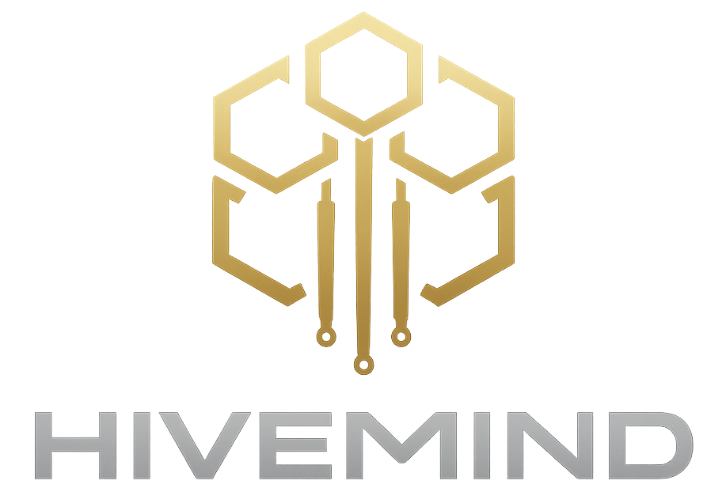
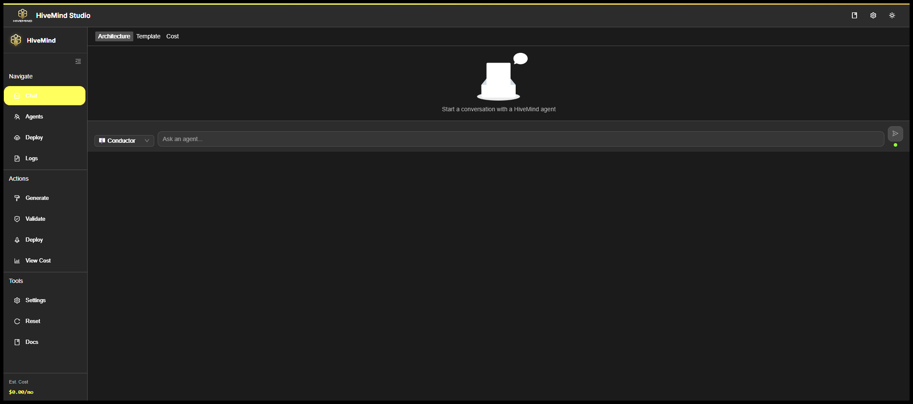
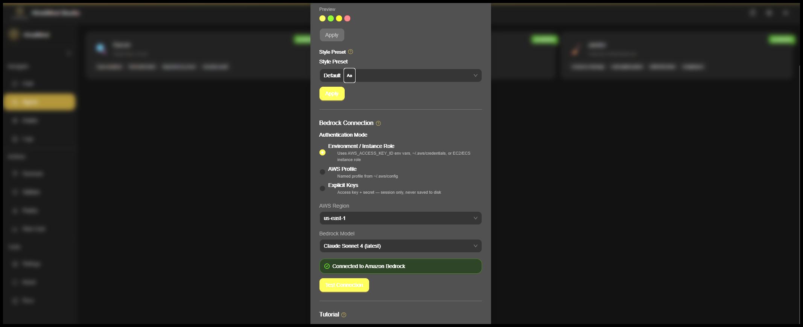

<div align="center">
  

  <h1>HiveMind Studio</h1>
  <p><strong>Multi-agent AI platform for automated AWS infrastructure deployment</strong></p>

  <p>
    
    
    
    
    
  </p>
</div>

---

HiveMind is a production-ready multi-agent AI system built with the **Strands SDK** and **Amazon Bedrock**. It ships with a full-featured **React web studio** for real-time agent chat, infrastructure deployment, CloudWatch log browsing, and deployment tracking — all in one place.

## Screenshots

<div align="center">
  
  <p><em>HiveMind Studio — sidebar navigation, chat view, and real-time agent streaming</em></p>
</div>

<div align="center">
  
  <p><em>Settings panel — Bedrock auth configuration, theme presets, and style options</em></p>
</div>

---

## Features

**Multi-Agent Backend**

- 3 specialized Strands agents: Recon, Conductor, Janitor
- Real-time streaming chat via WebSocket (`stream_async`)
- Amazon Bedrock integration with Claude Sonnet 4 (default)
- Multiple auth modes: env vars, AWS profile, or explicit keys
- CloudWatch log browsing and live tailing
- CloudFormation deployment tracking with event streaming

**HiveMind Studio (Web UI)**

- React 18 + Ant Design — dark/light mode, 6 color themes, 4 style presets
- 200px collapsible sidebar with grouped navigation (Navigate / Actions / Tools)
- Animated HiveMind logo with pulse glow and hover spin
- Centered settings modal with Bedrock auth configuration and live connection test
- Streaming chat with per-message agent switching
- Offline fallback mode when backend is unreachable

---

## Architecture

```
HiveMind/
├── hivemind_web/          # FastAPI backend
│   ├── server.py          # REST + WebSocket endpoints
│   ├── agent_router.py    # Agent registry
│   ├── bedrock_auth.py    # Multi-mode AWS auth (env/profile/keys)
│   ├── session_manager.py # WebSocket session tracking
│   └── metrics_tracker.py # Interaction metrics
├── src/
│   ├── agents/            # Strands agent definitions
│   ├── tools/             # Agent tools
│   └── schemas/           # Data models
├── HMWebApp/              # React frontend (Vite + TypeScript)
│   └── src/
│       ├── components/    # UI components
│       ├── contexts/      # ThemeContext, AuthContext
│       ├── hooks/         # useWebSocket
│       ├── pages/         # StudioPage, LandingPage, DocsLayout
│       └── services/      # chatService, logService, deploymentService
├── tests/                 # Python test suite
├── .env.example           # Environment variable template
└── requirements.txt       # Python dependencies
```

### Agents

| Agent | Role | Capabilities |
|-------|------|-------------|
| 🔍 Recon | Repository Scout | Repo analysis, tech detection, dependency scan, security audit |
| 🎼 Conductor | Infrastructure Orchestrator | Infra design, CloudFormation, cost estimation, architecture |
| 🧹 Janitor | Cleanup & Maintenance | Resource cleanup, cost optimization, drift detection, compliance |

---

## Quick Start

### 1. Clone and install

```bash
git clone https://github.com/yourusername/hivemind.git
cd hivemind

python -m venv .venv
source .venv/bin/activate   # Windows: .venv\Scripts\activate
pip install -r requirements.txt
```

### 2. Configure AWS credentials

Copy `.env.example` to `.env` and fill in your credentials:

```bash
cp .env.example .env
```

Three auth modes are supported — pick one:

```bash
# Option A: env vars
AWS_ACCESS_KEY_ID=AKIA...
AWS_SECRET_ACCESS_KEY=...
AWS_DEFAULT_REGION=us-east-1

# Option B: named AWS profile (leave keys blank)
# Set auth_mode = "profile" in the Studio settings UI

# Option C: configure via the Studio UI at runtime (keys never saved to disk)
```

Make sure your IAM user/role has `bedrock:InvokeModel` permission on the Claude model you want to use.

### 3. Start the backend

```bash
uvicorn hivemind_web.server:app --reload --port 8000
```

### 4. Start the frontend

```bash
cd HMWebApp
npm install
npm run dev
# Opens at http://localhost:3000
```

### 5. Configure Bedrock in the UI

Open Settings (⚙️ in the top bar) → **Bedrock Connection** → choose your auth mode → **Test Connection**.

Once connected, head to **Chat** and start talking to an agent.

---

## Bedrock Authentication

The backend supports three auth modes, configurable per-session from the UI or via environment variables:

| Mode | How it works |
|------|-------------|
| `env` | boto3 default chain — env vars, `~/.aws/credentials`, instance role |
| `profile` | Named profile from `~/.aws/config` |
| `keys` | Explicit access key + secret passed at runtime (never persisted to disk) |

The frontend `BedrockAuthPanel` (Settings → Bedrock Connection) lets you switch modes, pick a region, choose a model, and validate the connection with a single click.

---

## API Reference

### REST

| Method | Path | Description |
|--------|------|-------------|
| `GET` | `/api/agents` | List available agents |
| `POST` | `/api/auth/validate` | Validate Bedrock credentials |
| `GET` | `/api/deployments` | List deployments |
| `GET` | `/api/logs/groups` | List CloudWatch log groups |
| `GET` | `/api/logs/events` | Fetch log events |

### WebSocket

**`ws://host/ws/chat`** — real-time agent chat with streaming

Client sends:

```json
{ "type": "message", "agent_id": "conductor", "message": "...", "auth_config": { ... } }
{ "type": "set_auth", "auth_config": { "auth_mode": "env", "region": "us-east-1", "model_id": "..." } }
{ "type": "switch_agent", "agent_id": "recon" }
```

Server streams:

```json
{ "type": "stream_start", "message_id": "...", "agent_id": "conductor" }
{ "type": "stream_chunk", "message_id": "...", "content": "Hello" }
{ "type": "stream_end",   "message_id": "...", "metrics": { ... } }
{ "type": "auth_status",  "ok": true, "message": "Connected to Amazon Bedrock" }
```

---

## Testing

```bash
# Python backend tests
pytest -q

# Frontend tests (179 passing)
cd HMWebApp
npx vitest run --silent
```

The frontend test suite covers unit tests and property-based tests (fast-check) across all components, contexts, and services.

---

## Tech Stack

| Layer | Technology |
|-------|-----------|
| AI Agents | [Strands SDK](https://strandsagents.com) + Amazon Bedrock |
| LLM | Claude Sonnet 4 (default), Nova Pro/Lite, Claude 3.5 |
| Backend | FastAPI + uvicorn + WebSockets |
| Frontend | React 18 + TypeScript + Vite |
| UI | Ant Design 5 |
| AWS SDK | boto3 / botocore |
| Testing (Python) | pytest + Hypothesis |
| Testing (TS) | Vitest + fast-check + Testing Library |

---

## Requirements

- Python 3.10+
- Node.js 18+
- AWS account with Bedrock access (Claude model enabled in your region)
- `strands-agents >= 1.0.0`

---

## Learn More

- [Strands SDK Docs](https://strandsagents.com/latest/documentation/)
- [Amazon Bedrock](https://aws.amazon.com/bedrock/)
- [Ant Design](https://ant.design/)

---

## License

Educational / personal use. See `LICENSE`.
