# HiveMind AutoDeploy

A production-ready multi-agent AI system built with **Strands SDK** that automatically deploys applications from source code repositories to AWS infrastructure with comprehensive testing and rollback capabilities.

## 🎯 Features

- **Intelligent Deployment**: 6 specialized AI agents automatically analyze, build, and deploy applications
- **What-If Mode**: Simulate deployments without making changes - see costs, resources, and timeline predictions
- **Documentation Analysis**: Automatically extracts requirements from README, DEPLOY.md, and other docs
- **Multi-Agent Architecture**: Specialized agents for reconnaissance, compilation, infrastructure, deployment, and security
- **AWS Integration**: Automatic provisioning of VPC, EC2, RDS, ALB (Application Load Balancer), and security groups
- **Tech Stack Detection**: Supports Node.js, Python, and Go applications with automatic framework detection
- **Application Load Balancer**: Automatic ALB creation for web services with health checks
- **Complete Rollback**: Full resource cleanup with dependency-aware teardown
- **Resource Tracking**: Tag-based AWS resource discovery and orphan detection
- **Built-in Observability**: Traces, metrics, and tool usage tracking via Strands SDK
- **Professional CLI**: Easy-to-use command-line interface with rollback, destroy, and reconcile commands
- **Color-Coded Output**: Visual feedback with color-coded CLI output for better readability
- **Comprehensive Testing**: 200+ tests including 55 property-based tests with Hypothesis

## 🏗️ Architecture

The system uses **6 specialized agents** coordinated by a Conductor:

```mermaid
graph TD
    A[🎯 HiveMind Control Plane<br/>Orchestrates all agents]
    B[🔍 Recon<br/>Analyze documentation]
    C[🔨 Compiler<br/>Build application]
    D[☁️ Provisioner<br/>AWS infrastructure]
    E[🚀 Deployer<br/>Deploy application]
    F[🔒 Sheriff<br/>Security hardening]
    
    A --> B
    A --> C
    B --> C
    C --> D
    D --> E
    E --> F
    
    style A fill:#4a90e2,stroke:#2e5c8a,stroke-width:2px,color:#fff
    style B fill:#50c878,stroke:#2d7a4a,stroke-width:2px,color:#fff
    style C fill:#ff6b6b,stroke:#cc5555,stroke-width:2px,color:#fff
    style D fill:#ffd93d,stroke:#ccae31,stroke-width:2px,color:#333
    style E fill:#a78bfa,stroke:#7c5fd8,stroke-width:2px,color:#fff
    style F fill:#f97316,stroke:#c75a11,stroke-width:2px,color:#fff
```



### The Agents

1. **🎯 Control Plane** - Orchestrates the deployment workflow and communicates with users
2. **🔍 SA (Solutions Architect)** - Analyzes documentation to extract deployment requirements
3. **🔨 DevOps** - Analyzes repositories and builds applications (Node.js, Python, Go)
4. **☁️ SysEng (Systems Engineering)** - Provisions AWS infrastructure (VPC, EC2, RDS, ALB)
5. **🚀 Release-Engineer** - Deploys and configures applications on infrastructure
6. **🔒 SecOps (Security Operations)** - Hardens security across infrastructure and applications

### Powered by Strands SDK

This project uses the [Strands SDK](https://strandsagents.com) for AI agent orchestration, providing:
- Automatic tool selection by LLM
- Built-in agent loop and reasoning
- Comprehensive observability and metrics
- OpenTelemetry integration

## 🚀 Quick Start

### Installation

**Option 1: Quick Install (Recommended)**
```bash
# Clone the repository
git clone https://github.com/yourusername/hivemind-autodeploy.git
cd hivemind-autodeploy

# Run installer (installs to ~/.hivemind by default)
./install.sh

# Or install to custom location
./install.sh /path/to/install

# Restart terminal or source your shell config
source ~/.zshrc  # or ~/.bashrc

# Verify installation
hivemind --help
hm --help
man hivemind
```

**Option 2: Development Setup**
```bash
# Clone and setup for development
git clone https://github.com/yourusername/hivemind-autodeploy.git
cd hivemind-autodeploy

# Create virtual environment
python3 -m venv .venv
source .venv/bin/activate

# Install dependencies
pip install -r requirements.txt

# Use with python -m
python -m src.cli --help
```

### 1. Configure AWS Credentials

```bash
# Create virtual environment
python -m venv .venv
source .venv/bin/activate  # On macOS/Linux

# Install dependencies (includes strands-agents)
pip install -r requirements.txt
```

### 2. Configure AWS Credentials

```bash
# Option 1: AWS CLI
aws configure

# Option 2: Environment variables
export AWS_ACCESS_KEY_ID=your_key
export AWS_SECRET_ACCESS_KEY=your_secret
export AWS_REGION=us-east-1
```

### 3. Try What-If Mode (Safe!)

```bash
# Simulate deployment without making changes
hivemind deploy https://github.com/user/my-app "Test deployment" --what-if

# Or use the alias
hm deploy https://github.com/user/my-app "Test" --what-if

# Output shows:
# - Estimated monthly costs
# - Resources to be created
# - Timeline predictions
# - No AWS charges!
```

### 4. Deploy an Application

**Using installed commands:**
```bash
# Analyze repository first
hivemind analyze https://github.com/user/my-app

# Simulate deployment
hivemind deploy https://github.com/user/my-app "Deploy app" --what-if

# Real deployment
hivemind deploy https://github.com/user/my-app "Production deployment"

# Check status
hivemind status <deployment-id>

# Use short alias
hm status <deployment-id>
```

**Using Python module (development):**
```bash
# Analyze repository first
python -m src.cli analyze https://github.com/user/my-app

# Simulate deployment
python -m src.cli deploy https://github.com/user/my-app "Deploy app" --what-if

# Real deployment
python -m src.cli deploy https://github.com/user/my-app "Production deployment"

# Check status
python -m src.cli status <deployment-id>
```

**Python API:**
```python
from src.agents.strands_conductor import StrandsConductorAgent

# Create conductor agent
conductor = StrandsConductorAgent()

# What-if mode (safe, no AWS charges)
result = conductor.deploy(
    repo_url="https://github.com/user/my-app",
    description="Deploy my Node.js application with PostgreSQL",
    dry_run=True  # What-if mode!
)

# Real deployment
result = conductor.deploy(
    repo_url="https://github.com/user/my-app",
    description="Deploy my Node.js application with PostgreSQL",
    dry_run=False  # Real deployment
)

print(f"Deployment ID: {result.deployment_id}")
print(f"Status: {result.state.status}")
```

## 📁 Project Structure

```
hivemind-autodeploy/
├── src/                          # Source code
│   ├── agents/                   # AI agents
│   ├── tools/                    # Agent tools
│   ├── schemas/                  # Data models
│   ├── utils/                    # Utilities
│   └── cli.py                    # CLI interface
├── tests/                        # Test suite (200+ tests)
├── bin/                          # CLI wrappers (hivemind, hm)
├── docs/                         # Man pages
├── Historical-Dev-Notes/         # Development history
├── README.md                     # This file
├── QUICK_START.md                # Getting started guide
├── TESTING_GUIDE.md              # Testing guide
├── AWS_CREDENTIALS_SETUP.md      # AWS setup guide
├── install.sh                    # Installer script
├── requirements.txt              # Python dependencies
└── pytest.ini                    # Test configuration
```

**Working files location:** `~/.hivemind/`
```
~/.hivemind/
├── deployments/                  # Deployment state files
├── test_deployments/             # Test deployment files
├── analyzed_repos/               # Cloned repositories
└── analysis/                     # Analysis workspace
```

**Note:** All working files are stored in `~/.hivemind/` to keep the repository clean. This directory is created automatically on first use.

## 🧪 Testing

HiveMind has comprehensive test coverage with **200+ tests** including property-based testing:

```bash
# Run all tests
pytest -v

# Run property-based tests (55 tests, < 30 seconds)
pytest -m property -v --hypothesis-show-statistics

# Run unit tests only
pytest -m unit -v

# Run with coverage
pytest --cov=src tests/

# Run specific test file
pytest tests/test_orchestration_property.py -v
pytest tests/test_alb_integration.py -v

# Run quietly (for CI/CD)
pytest -q
```

### Test Suite Highlights ✨
- **55 property-based tests** using Hypothesis (no credentials required!)
- **7 ALB integration tests** for load balancer support
- **30+ unit test files** covering all components
- **Fast execution**: All property tests run in < 30 seconds
- **No external dependencies**: Tests work without AWS credentials or network access

## 💡 CLI Commands

After installation, use `hivemind` or `hm` from anywhere:

### Core Commands
```bash
# Analyze repository (SA only)
hivemind analyze https://github.com/user/app

# Simulate deployment (safe, no AWS charges)
hivemind deploy https://github.com/user/app "Deploy" --what-if

# Real deployment
hivemind deploy https://github.com/user/app "Production v1.0"

# Show deployment plan
hivemind plan <deployment-id>

# Check status
hivemind status <deployment-id>

# Retry failed deployment
hivemind retry <deployment-id>

# Use short alias
hm deploy https://github.com/user/app "Test" --what-if
```

### Cleanup Commands ✨ NEW
```bash
# Clean up temporary files
hivemind cleanup

# Clean up with backup archive
hivemind cleanup --backup

# Clean up without confirmation
hivemind cleanup --yes
```

### Resource Management
```bash
# Rollback deployment (delete all resources)
hivemind rollback <deployment-id>

# Destroy deployment (alias for rollback)
hivemind destroy <deployment-id> --force

# Reconcile state with AWS (find orphaned resources)
hivemind reconcile <deployment-id>

# Find all orphaned resources
hivemind find-orphans
```

### Help & Documentation
```bash
# Get help
hivemind --help
hivemind deploy --help

# Read manual
man hivemind

# List all deployments
hivemind list
hivemind list --status completed
```

## 🎓 Example Usage

**What-If Mode:**
```bash
# See example_what_if.py for complete examples
python example_what_if.py
```

**Python API:**
```bash
# See example_strands_usage.py for complete examples
python example_strands_usage.py
```

## 📊 Current Status

### ✅ Production Ready (95% Complete)

**Core Functionality:**
- ✅ All 6 Strands agents (Conductor, Recon, Compiler, Provisioner, Deployer, Sheriff)
- ✅ Repository analysis and tech stack detection (Node.js, Python, Go)
- ✅ Build system (npm, pip, go build)
- ✅ AWS infrastructure provisioning (VPC, EC2, RDS, ALB)
- ✅ Application deployment via SSH
- ✅ Security hardening (SSL, firewall, OS hardening)
- ✅ What-if mode (dry-run with cost predictions)
- ✅ State management and logging
- ✅ Error handling and recovery
- ✅ Complete rollback and cleanup
- ✅ Resource tracking with AWS tags
- ✅ Orphaned resource detection

**Testing:**
- ✅ 200+ tests passing
- ✅ 55 property-based tests (Hypothesis)
- ✅ 7 ALB integration tests
- ✅ Fast execution (< 30 seconds for property tests)
- ✅ No credentials required for tests

**Documentation:**
- ✅ README with setup instructions
- ✅ QUICK_START guide
- ✅ TESTING_GUIDE
- ✅ AWS_CREDENTIALS_SETUP
- ✅ Inline code documentation
- ✅ Phase completion summaries

### 🎯 Key Achievements

**Property-Based Testing:**
- 55 comprehensive property tests covering all system behaviors
- Tests run without AWS credentials or network access
- Fast execution enables rapid development
- Hypothesis generates 100+ test cases per property

**ALB Integration:**
- Automatic load balancer creation for web services
- Health check configuration
- Cost estimation (~$16.43/month)
- Complete integration with Provisioner and Conductor

**Resource Management:**
- Tag-based resource discovery (HM-DeploymentId tags)
- Orphaned resource detection
- Dependency-aware cleanup
- Cost tracking per deployment

### ⏳ Optional Enhancements (5%)
- ⏳ Integration tests with real AWS (requires AWS account)
- ⏳ Performance optimization (caching, parallelization)
- ⏳ Additional language support (Java, Rust)

## 🔧 Requirements

- Python 3.10+
- AWS account with appropriate permissions
- Strands SDK (installed via requirements.txt)
- AWS credentials configured

## 📖 Learn More

- [Strands Documentation](https://strandsagents.com/latest/documentation/)
- [Strands GitHub](https://github.com/strands-agents)
- [AWS Well-Architected Framework](https://aws.amazon.com/architecture/well-architected/)

## 🤝 Contributing

This is a learning project for understanding multi-agent systems and the Strands SDK. Feel free to explore and extend!

## 📝 License

This project is for educational purposes.
